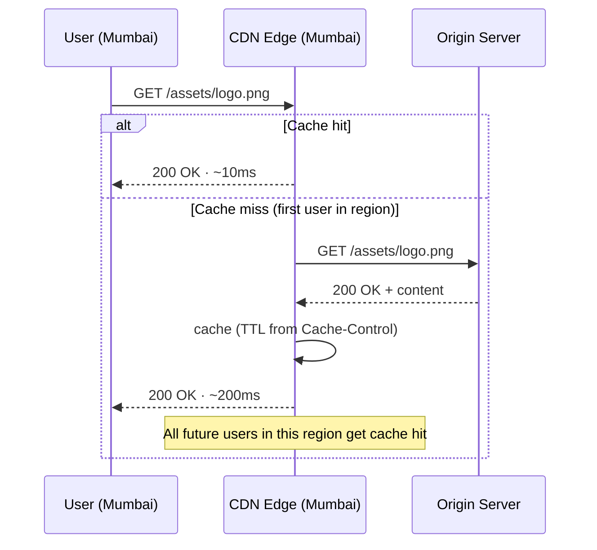
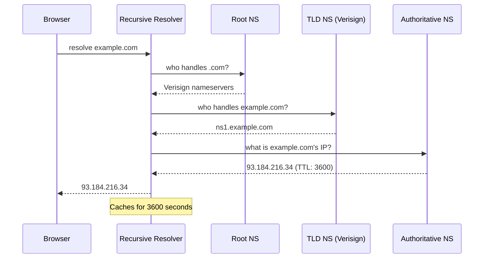

# System Design Foundations

> **Purpose:** Core concepts that underpin every system design interview.  
> **Rule:** Every design decision must be justified using one or more of these concepts.

---

## Table of Contents

1. [CAP Theorem](#1-cap-theorem)
2. [PACELC — The Extension of CAP](#2-pacelc--the-extension-of-cap)
3. [Consistency Models](#3-consistency-models)
4. [SQL vs NoSQL](#4-sql-vs-nosql)
5. [Caching Strategies](#5-caching-strategies)
6. [Load Balancing](#6-load-balancing)
7. [Message Queues](#7-message-queues)
8. [CDN](#8-cdn)
9. [DNS Internals](#9-dns-internals)
10. [Database Sharding and Replication](#10-database-sharding-and-replication)
11. [The System Design Framework](#11-the-system-design-framework)

---

## 1. CAP Theorem

A distributed system can guarantee **at most two** of three properties simultaneously.

```
              Consistency (C)
              All nodes same data
                    /\
                   /  \
                  /    \
           CP   /  ???  \  CA
      HBase    /  (only   \ PostgreSQL
      etcd    /  single    \ MySQL
    Zookeeper/   machine)   \(single node)
             /________________\
Availability(A)              Partition(P)
Always responds              Survives network split

        AP
   Cassandra, DynamoDB
   CouchDB, DNS
```

| Property | Meaning |
|---|---|
| **C — Consistency** | Every read receives the most recent write or an error. All nodes see the same data at the same time. |
| **A — Availability** | Every request receives a response — not necessarily the latest data. System is always operational. |
| **P — Partition tolerance** | System continues operating even when network messages between nodes are dropped or delayed. |

### The real-world constraint

**Network partitions are not optional** — they will happen in any distributed system. The real choice is always **CP** or **AP**. CA systems only exist on a single machine.

### Scenario decision map

| Scenario | Choice | Reason |
|---|---|---|
| Bank transfer / payments | **CP** | Stale read = money appears in two accounts simultaneously |
| DNS resolution | **AP** | Slightly stale IP is far better than no answer at all |
| Shopping cart | **AP** | Merge conflicts at checkout; never block the shopping experience |
| Social media like counter | **AP** | Approximate count is perfectly acceptable |
| Domain availability check | **AP** (check) + **CP** (registration) | Fast check OK; actual write must be atomic |
| Distributed config store (etcd) | **CP** | Half the fleet running old DB credentials = catastrophe |

### Interview sentence

> "Network partitions will happen — they are not optional. So the real choice is always CP vs AP. I'd choose CP here because a stale read causes [specific harm]. I'd choose AP because eventual convergence is acceptable here because [reason]."

---

## 2. PACELC — The Extension of CAP

CAP only describes behaviour **during a partition**. PACELC also addresses normal operation:

```
         Network Partition?
              /       \
            YES        NO
            /           \
    Choose between    Choose between
    A vs C            L vs C
    (Availability     (Latency
    vs Consistency)   vs Consistency)
```

| Category | Systems | Normal operation trade-off |
|---|---|---|
| **PA/EL** | DynamoDB, Cassandra, CouchDB | Sacrifice consistency for low latency |
| **PC/EC** | HBase, Zookeeper, etcd, Spanner | Pay latency for correctness |

This matters because even without a partition, synchronous replication (strong consistency) adds latency compared to async replication (eventual consistency).

---

## 3. Consistency Models

From **strongest** to **weakest**:

```
STRONGEST
    │
    │  Linearizability  — operations appear atomic at a real-time point
    │                     (etcd, Google Spanner)
    │
    │  Strong           — every read returns the latest write
    │                     (PostgreSQL sync replication, Zookeeper)
    │
    │  Sequential       — all nodes see same order, not necessarily real-time
    │
    │  Causal           — causally related ops seen in same order everywhere
    │                     (MongoDB causal sessions, collaborative editing)
    │
    │  Read-your-writes — you always see your own writes
    │                     (required by virtually all user-facing apps)
    │
    │  Eventual         — replicas converge given no new writes
    │                     (DNS, CDN caches, Cassandra, DynamoDB default)
    │
WEAKEST
```

### Key distinctions for interviews

**Strong vs Eventual:** strong consistency costs latency — all replicas must agree before returning. Eventual consistency is faster but reads may be stale for milliseconds to seconds.

**Read-your-writes:** if a user updates their profile picture and immediately sees the old one, the app is broken. This is not just a consistency model — it is a product requirement for any user-facing system.

**Eventual consistency conflict resolution strategies:**
- LWW (last-write-wins) — highest timestamp wins. Simple but can lose data.
- CRDTs (conflict-free replicated data types) — for counters and sets that can merge automatically.
- Application-level merge — custom logic to reconcile conflicts.

### Interview one-liner

> "Strong consistency: after a write, every read returns that value — costs latency, all replicas must agree. Eventual consistency: replicas converge over time but reads may be stale — much faster, acceptable when approximate values are fine like view counts, like counts, DNS TTLs."

---

## 4. SQL vs NoSQL

### Decision framework

```
What is the primary access pattern?
         │
         ├─ Complex JOINs, ACID multi-table transactions?
         │         → SQL (PostgreSQL, MySQL)
         │
         ├─ Simple lookup by ID, caching, sessions?
         │         → Key-value (Redis, DynamoDB)
         │
         ├─ Flexible / nested / variable schema?
         │         → Document (MongoDB, Firestore)
         │
         ├─ Write-heavy, time-ordered, massive scale?
         │         → Wide-column (Cassandra, HBase)
         │
         ├─ Relationship traversal is the core query?
         │         → Graph (Neo4j, Amazon Neptune)
         │
         └─ Time-series metrics, IoT, monitoring?
                   → TimescaleDB, InfluxDB
```

### Comparison table

| Type | Examples | Strengths | Weaknesses | Best for |
|---|---|---|---|---|
| **SQL** | PostgreSQL, MySQL | ACID, complex queries, rich indexing, mature tooling | Hard to scale writes horizontally, schema migrations | Users, orders, payments, anything needing transactions |
| **Key-value** | Redis, DynamoDB | O(1) get/set, extreme throughput, built-in scaling | No joins, must know key upfront, limited query flexibility | Cache, sessions, rate limiting counters, feature flags |
| **Document** | MongoDB, Firestore | Flexible schema (no migrations), nested data natural | No native JOINs, eventual consistency default, data duplication | User profiles, CMS content, product catalogs |
| **Wide-column** | Cassandra, HBase | Massive horizontal write scale, excellent time-series | Query patterns defined upfront, no JOINs, complex operations | Logs, IoT, activity feeds at Twitter/Instagram scale |
| **Graph** | Neo4j, Neptune | Relationship traversal O(edges) not O(rows) | Not general purpose, poor aggregation | Social networks, fraud detection, RBAC hierarchies |

### SQL scale pattern (important to know)

```
Start: Single primary
  ↓
Add read replicas (primary + replica ×3)
  ↓
Connection pooling (PgBouncer)
  ↓
Caching layer (Redis in front of DB)
  ↓
Sharding (only when single primary write throughput is genuinely exhausted)
```

> Premature sharding is one of the most expensive architectural mistakes. SQL scales reads very effectively with replicas.

### Interview warning

> "The common mistake: 'I'd use MongoDB because NoSQL scales better.' Scale depends on access patterns, not the database type. I choose based on the specific access patterns and consistency requirements of this system."

---

## 5. Caching Strategies

### Caching layers — always mention all in a design

```
Request flow →

 ┌──────────┐    ┌──────────┐    ┌──────────┐    ┌──────────┐    ┌──────────┐
 │  Client  │───▶│   CDN    │───▶│  API GW  │───▶│  Redis   │───▶│   DB     │
 │ Browser  │    │  Edge    │    │  Cache   │    │Memcached │    │ (source  │
 │  Cache   │    │ (static) │    │(responses│    │ (app     │    │ of truth)│
 └──────────┘    └──────────┘    │ per user)│    │  layer)  │    └──────────┘
                                 └──────────┘    └──────────┘

Each layer has different TTLs and invalidation strategies.
```

### Cache-aside (lazy loading) — most common

```
READ:
  App ──get(key)──▶ Cache
                         miss
  App ◀──────────────────── Cache
  App ──read(key)──▶ DB
  App ◀──data────────── DB
  App ──set(key,data,TTL)──▶ Cache
  App ◀──return data to client

SUBSEQUENT READ:
  App ──get(key)──▶ Cache
  App ◀──data (HIT)── Cache  ← fast path
```

✅ Only caches what is requested. Resilient — cache failure just means slower reads (DB fallback).  
❌ Cache miss = 3 round trips. Cold start is slow. Stale if DB is updated externally without invalidation.  
**Use for:** read-heavy workloads, URL redirects, domain lookups, any system where most data is rarely accessed.

### Write-through — strong consistency

```
WRITE:
  App ──write(key, val)──▶ Cache
  Cache ──write(key, val)──▶ DB     ← both written synchronously
  DB ◀──OK───────────────── DB
  Cache ◀──OK──────────────── (both written)
  App ◀──OK (return to client)
```

✅ Cache never stale. Reads are always fast after the first write.  
❌ Write latency doubles (cache + DB). Cache fills with data that may never be read.  
**Use for:** payment state, user balances, anything that must always be fresh on read.

### Write-behind (write-back) — highest write throughput

```
WRITE:
  App ──write(key, val)──▶ Cache
  App ◀──OK (immediate response)    ← returns before DB write

ASYNC (background):
  Cache ──flush queue──▶ DB         ← eventual consistency
```

✅ Lowest write latency. Absorbs write spikes well.  
❌ Data loss risk if cache crashes before flush. Not for ACID requirements.  
**Use for:** analytics counters, view counts, like counts, any metric where small data loss is acceptable.

### Eviction policies

| Policy | How | When to use |
|---|---|---|
| **LRU** (least recently used) | Evict item not accessed for longest time | Default choice. Good when recent = likely future access. |
| **LFU** (least frequently used) | Evict item accessed fewest times overall | Stable popularity patterns — old trending items evicted. |
| **TTL** (time to live) | Expire after N seconds regardless of access | Always combine with other policies. Prevents stale data. |
| **FIFO / Random** | First-in-first-out or random | Use only when access patterns are completely unknown. |

### Asymmetric TTL — a key senior detail

Different states change at different rates — match the TTL to the volatility:

```
State              Volatility     TTL recommendation
─────────────────────────────────────────────────────
Domain taken       Very low       1 hour   (expiry takes weeks)
Domain available   High           5 min    (can be taken any moment)
Video metadata     Low            24 hours
User presence      High           5 min
Static assets      None           1 year   (use content-addressed filenames)
```

### Cache stampede (thundering herd) prevention

When a popular entry's TTL expires, many concurrent requests simultaneously miss and hammer the DB.

```
Solutions:

1. Probabilistic early expiration
   if (TTL < 5min && random() < 0.1) background_refresh();

2. Distributed lock on miss
   lock = redis.SETNX("lock:key", 1, EX=5)
   if lock: fetch from DB, repopulate cache
   else:    sleep(100ms), retry from cache

3. Stale-while-revalidate
   Serve stale data immediately, refresh in background
```

---

## 6. Load Balancing

### L4 vs L7

```
L4 — Transport Layer                L7 — Application Layer
────────────────────────────        ────────────────────────────────────
Routes on: IP + TCP/UDP port        Routes on: HTTP headers, URL, cookies

Client                              Client
  │                                   │
  ▼                                   ▼
L4 LB                               L7 LB
  ├──▶ Server 1 (TCP)                 ├──▶ /api/*      → API Service
  ├──▶ Server 2 (TCP)                 ├──▶ /static/*   → CDN / Object Store
  └──▶ Server 3 (TCP)                 └──▶ WebSocket   → WS Service

Faster (no packet inspection)       Slower but smarter
Good for: raw TCP, UDP, gaming      Good for: microservices, HTTP APIs,
                                    SSL termination, A/B testing
```

### Balancing algorithms

| Algorithm | How it works | Best for |
|---|---|---|
| **Round robin** | Rotate through servers in order | Identical servers, simple default |
| **Weighted round robin** | Higher-capacity servers get proportionally more | Heterogeneous fleets |
| **Least connections** | Route to server with fewest active connections | Variable-duration requests (WebSocket, video streaming) |
| **IP hash / sticky** | Same client IP → same server always | Session state not shared across servers |
| **Power of two choices** | Pick 2 servers randomly, route to less busy one | Near-optimal performance, very simple to implement |

### Health checks and zero-downtime deploys

```
Load balancer pings /health every N seconds
  ├─ Fail N consecutive checks → remove from rotation
  ├─ Pass checks again         → re-add to rotation
  └─ Zero-downtime deploy:
       1. Remove old instance from LB rotation
       2. Wait for in-flight requests to drain
       3. Bring up new instance
       4. Add new instance to LB rotation
       5. Terminate old instance
```

---

## 7. Message Queues

### Core topology

```
                   ┌─────────────────────────────┐
                   │      Message Broker          │
                   │   (Kafka / RabbitMQ / SQS)   │
                   │                              │
Producer ─publish─▶│  [msg1][msg2][msg3][msg4]   │─consume─▶ Consumer A
                   │                              │─consume─▶ Consumer B
                   │  Dead Letter Queue (DLQ)     │─consume─▶ Consumer C
                   │  [failed-msg1][failed-msg2]  │
                   └─────────────────────────────┘
```

### When to use a queue

| Scenario | Why a queue helps |
|---|---|
| **Async processing** | Return 200 OK immediately; transcode video / send email in background |
| **Load levelling** | Absorb traffic spikes; workers drain at steady rate regardless of burst |
| **Fan-out** | One "user registered" event → email service + analytics + profile creator each consume independently |
| **Fault tolerance** | Email service goes down → messages queue up, delivered when it recovers |
| **Decoupling** | Producer doesn't need to know how many consumers exist or what they do |

### Kafka vs RabbitMQ

```
Kafka                                RabbitMQ
─────────────────────────────────    ─────────────────────────────────
Model: immutable append-only log     Model: traditional queue
Messages: retained for days/weeks    Messages: deleted after ACK
Consumers: consumer groups, each     Consumers: competing — one processes
           reads independently                  each message
Throughput: millions/sec             Throughput: thousands/sec

Best for:                            Best for:
  Event sourcing                       Task queues
  Analytics pipelines                  RPC-style jobs
  Audit logs                           Notifications
  High-throughput event streaming      Simpler setup needs
```

### Delivery guarantees

| Guarantee | Behaviour | Use for |
|---|---|---|
| **At-most-once** | 0 or 1 deliveries — may be lost | Metrics where losing a few is acceptable |
| **At-least-once** | 1+ deliveries — may duplicate | Most cases — consumer must be idempotent |
| **Exactly-once** | Delivered exactly once | Payments, financial transactions |

**Dead letter queue:** messages that fail after N retries → DLQ. Prevents one bad message from blocking the whole queue forever. Always configure a DLQ in production.

---

## 8. CDN

### How it works

```
User (Mumbai) ─────▶ DNS resolves to nearest edge node
                              │
                         CDN Edge (Mumbai)
                              │
                    ┌─────────┴──────────┐
                    │                    │
               Cache HIT            Cache MISS
               (~5-20ms)                │
               Return content      Fetch from Origin
                                   (London / US East)
                                   Cache for future requests
                                   (~100-300ms first user in region)
                                         │
                              All subsequent users in Mumbai
                              get cache hit (~5-20ms)
```

### Cache-Control headers

```http
Cache-Control: max-age=31536000, immutable    # versioned static assets (JS/CSS bundles)
Cache-Control: max-age=3600                   # semi-static (updated hourly)
Cache-Control: no-cache                       # revalidate before serving
Cache-Control: no-store                       # never cache (private, personalised)
```

### CDN request/response flow (Mermaid — for environments that render it)



### Pull CDN vs Push CDN

| | Pull CDN | Push CDN |
|---|---|---|
| **Mechanism** | Edge fetches from origin on first cache miss | You proactively push content to edge nodes |
| **Setup** | Zero configuration | Must manage which content to push and when |
| **First request** | Slightly slower (origin fetch) | Instant — already at edge |
| **Best for** | Unpredictable access patterns, most use cases | Large files with predictable high traffic (software releases, known viral videos) |

### When CDN is the architecture, not an optimisation

At YouTube's scale (46 Tbps of video) or any globally distributed read-heavy system, no origin cluster can serve the bandwidth. The CDN is the read architecture. Origin handles only cache misses and new content ingestion.

---

## 9. DNS Internals

### The 6-step resolution chain

```
User types example.com

Step 1: Browser DNS cache
        HIT → use cached IP, done
        ↓ miss

Step 2: OS resolver + /etc/hosts
        HIT → use cached IP, done
        ↓ miss

Step 3: Recursive resolver (ISP's DNS / 8.8.8.8)
        Caches and proxies on your behalf
        ↓

Step 4: Root nameservers (13 clusters worldwide)
        "Who handles .com?" → Verisign nameservers
        ↓

Step 5: TLD nameserver (Verisign for .com)
        "Who handles example.com?" → ns1.example.com
        ↓

Step 6: Authoritative nameserver (ns1.example.com)
        "What is example.com's IP?" → 93.184.216.34, TTL 3600
        ↓

Recursive resolver caches result for TTL (3600 sec = 1 hour)
Returns IP to browser
```

### DNS resolution sequence (Mermaid — for environments that render it)



### DNS record types

| Record | Maps | Example |
|---|---|---|
| **A** | hostname → IPv4 | `example.com → 93.184.216.34` |
| **AAAA** | hostname → IPv6 | Same for IPv6 |
| **CNAME** | hostname → hostname (alias) | `www.example.com → example.com` |
| **MX** | domain → mail server hostname | Routes incoming email to correct server |
| **NS** | domain → authoritative nameserver name | Which DNS server is authoritative |
| **TXT** | domain → arbitrary text | SPF records, DKIM, domain verification |

### TTL management

```
Low TTL (e.g. 300 sec):   Changes propagate quickly   ←→   More DNS queries to auth server
High TTL (e.g. 86400 sec): Fewer auth server queries  ←→   Changes take a day to propagate

Best practice for planned DNS changes:
  T-24h: lower TTL to 300 seconds
  T-0:   make the DNS change
  T+1h:  restore original TTL (e.g. 3600)
```

### CNAME at root domain — not permitted

A CNAME at the naked domain (apex record, e.g. `example.com`) is illegal per DNS spec — the root must be an A record. Solutions: AWS Route 53 ALIAS records, Cloudflare CNAME flattening — they resolve the indirection server-side and return an A record to the client.

---

## 10. Database Sharding and Replication

### Replication — scale reads

```
         Writes only                Reads distributed
              │                     │        │        │
              ▼                     ▼        ▼        ▼
        ┌──────────┐          ┌─────────┐ ┌─────────┐ ┌─────────┐
        │ Primary  │──async──▶│Replica 1│ │Replica 2│ │Replica 3│
        │          │──repl.──▶│         │ │         │ │         │
        └──────────┘          └─────────┘ └─────────┘ └─────────┘

Scale reads by adding replicas.
Writes remain a single-primary bottleneck.
Replication lag = reads may be slightly stale (eventually consistent).
```

**Primary-replica:** one primary handles all writes, replicas handle reads.  
**Multi-primary:** multiple primaries accept writes — conflict resolution required.  
Use multi-primary only when single-primary write throughput is genuinely exhausted.

### Sharding — scale writes

```
         Application
              │
              ▼
       ┌─────────────┐
       │ Shard Router│  (determines which shard owns this key)
       └──────┬──────┘
              │
    ┌─────────┼─────────┐
    ▼         ▼         ▼
┌───────┐ ┌───────┐ ┌───────┐
│Shard 1│ │Shard 2│ │Shard 3│
│user   │ │user   │ │user   │
│id 0-  │ │id 34- │ │id 67- │
│33%    │ │66%    │ │100%   │
└───────┘ └───────┘ └───────┘
```

| Strategy | How | Pros | Cons |
|---|---|---|---|
| **Hash sharding** | `shard = hash(key) % N` | Uniform distribution | No range queries across shards |
| **Range sharding** | A-M → shard 1, N-Z → shard 2 | Range queries work naturally | Hot shards if distribution uneven |
| **Directory sharding** | Lookup table: key → shard | Most flexible | Extra lookup hop adds latency |
| **Consistent hashing** | Virtual nodes on a ring | Adding/removing shards remaps only a fraction of keys | More complex implementation |

### Sharding trade-offs — always mention these

```
Cross-shard queries:   scatter-gather — expensive, avoid by design
JOINs across shards:   nearly impossible — must denormalise data
Re-sharding:           painful — design shard key for 10× growth from day one
Hotspot problem:       popular user routes all traffic to one shard despite hash
```

### The senior recommendation

> "Start with a single primary and read replicas. Only add sharding when a single primary cannot handle write throughput — which happens much later than most people think. Premature sharding is one of the most expensive architectural mistakes in distributed systems."

---

## 11. The System Design Framework

Apply this structure to every question. 45-60 minutes total.

### The six steps

```
┌─────────────────────────────────────────────────────────┐
│  Step 1 — Requirements clarification          (5 min)   │
│                                                         │
│  Functional:     Top 3-4 features only                  │
│  Non-functional: Scale (DAU, QPS), latency SLAs,        │
│                  availability (99.9% vs 99.99%),        │
│                  consistency requirements               │
│  Out of scope:   State explicitly what you'll ignore    │
├─────────────────────────────────────────────────────────┤
│  Step 2 — Capacity estimation                 (5 min)   │
│                                                         │
│  QPS       = requests/day ÷ 86,400                      │
│  Peak      = baseline × 3-10                            │
│  Storage   = records/day × avg_size × 365               │
│  Bandwidth = QPS × avg_response_size                    │
│  Cache     = total_data × 0.20 (hot 20% = 80% traffic) │
│                                                         │
│  Always show the arithmetic. Interviewers want to see   │
│  structured numerical reasoning.                        │
├─────────────────────────────────────────────────────────┤
│  Step 3 — High-level design                   (10 min)  │
│                                                         │
│  Draw the boxes: clients → LB → services → DB → cache  │
│  Walk the happy path end-to-end                         │
│  Separate read path and write path explicitly           │
├─────────────────────────────────────────────────────────┤
│  Step 4 — Component deep-dive                 (15 min)  │
│                                                         │
│  Pick 2-3 most complex components                       │
│  For each: schema, API, key algorithm, data structure   │
│  This is where LLD appears within HLD                   │
├─────────────────────────────────────────────────────────┤
│  Step 5 — Scale and reliability               (10 min)  │
│                                                         │
│  Identify bottlenecks at 10× current scale             │
│  DB: replicas for reads, sharding for writes            │
│  Cache: eviction strategy, stampede prevention          │
│  Services: horizontal scaling, circuit breakers         │
│  Network: CDN for static, rate limiting for abuse       │
├─────────────────────────────────────────────────────────┤
│  Step 6 — Trade-offs                          (5 min)   │
│                                                         │
│  "I chose X over Y because [reason].                    │
│   The trade-off is [what I give up],                    │
│   which is acceptable because [why]."                   │
└─────────────────────────────────────────────────────────┘
```

### Senior differentiators checklist

- [ ] Ask clarifying questions before drawing anything
- [ ] State data structure choice before writing code
- [ ] Mention distributed/multi-instance implications proactively
- [ ] Use correct HTTP semantics (410 vs 404, 429 vs 503, 302 vs 301)
- [ ] Mention idempotency for all write operations
- [ ] State when eventual consistency is the right answer and justify it
- [ ] Name the trade-off for every major design decision
- [ ] Name the failure mode for every component

---
