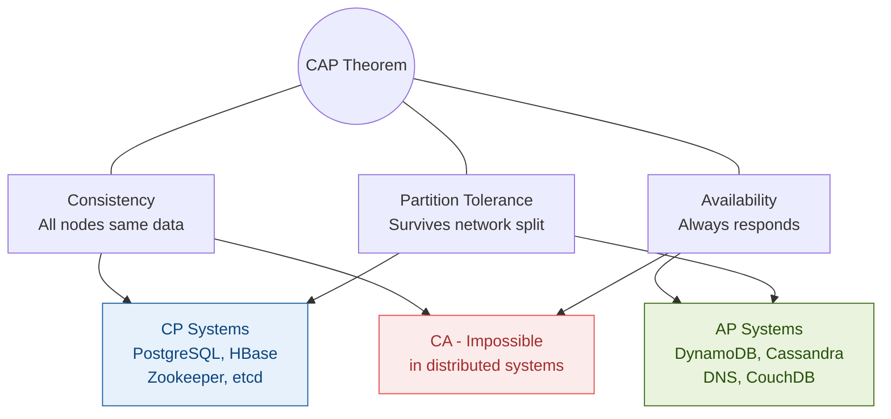
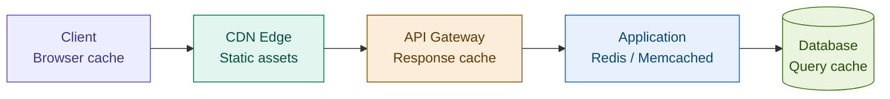
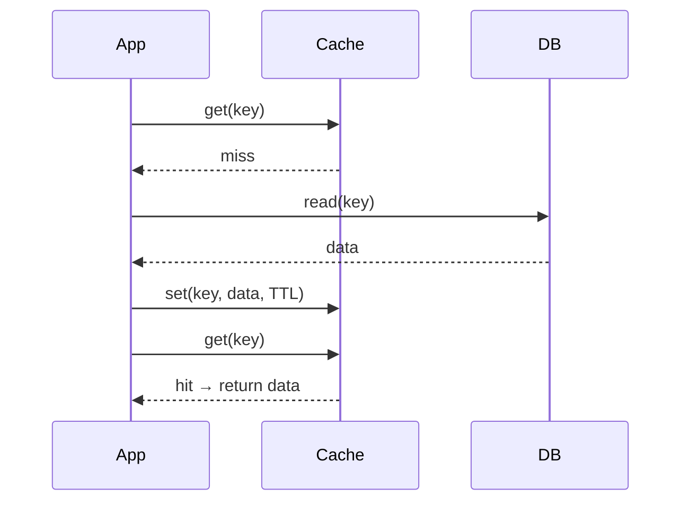
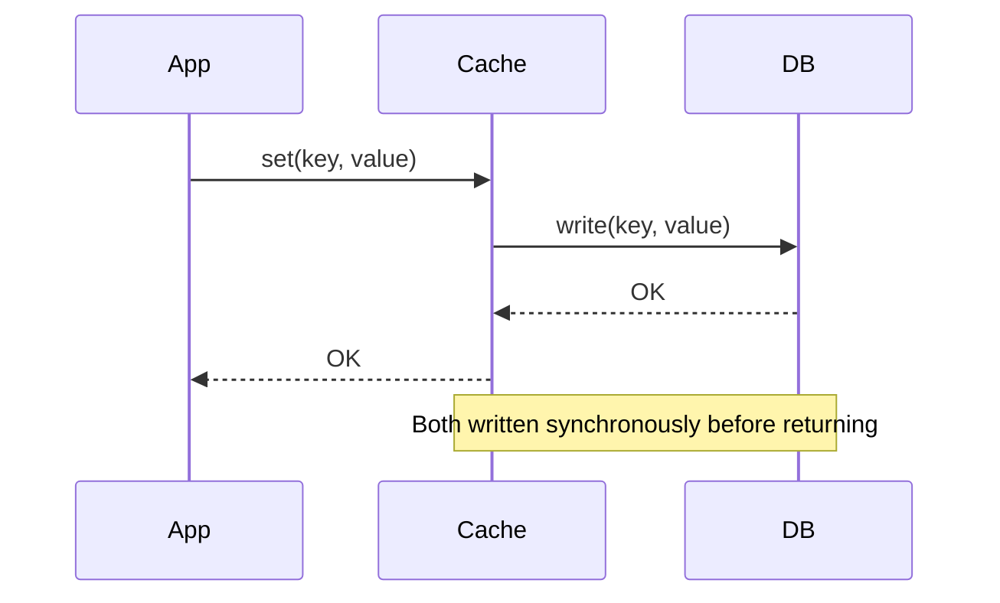
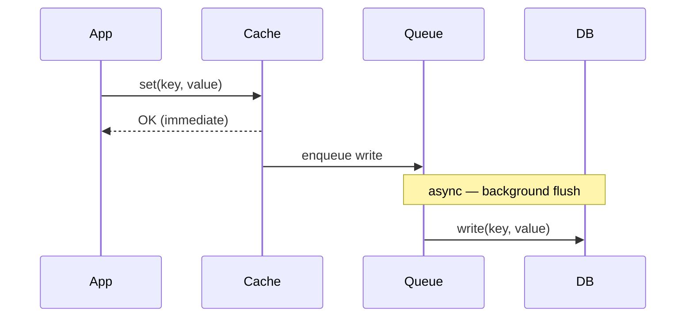
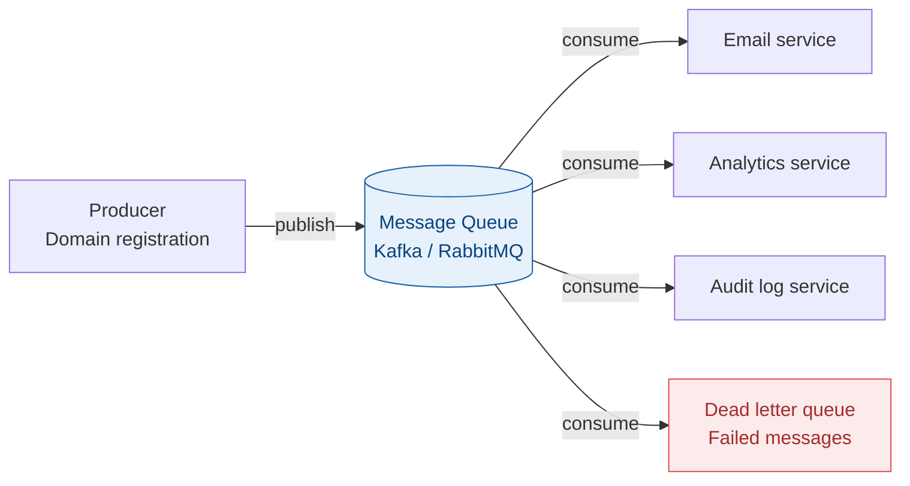
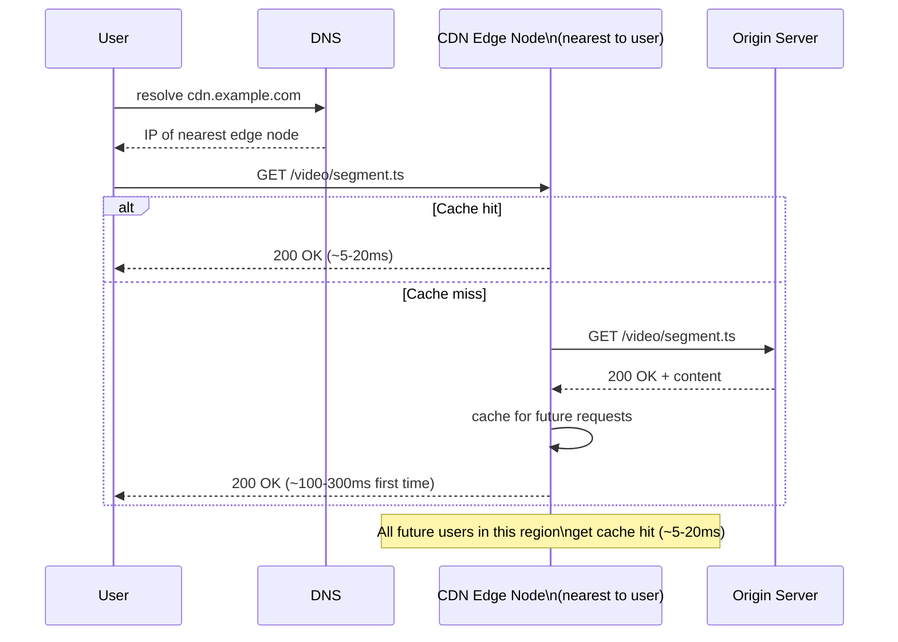
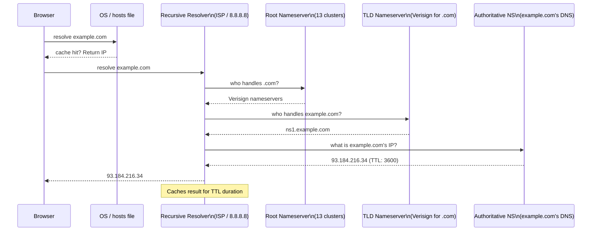
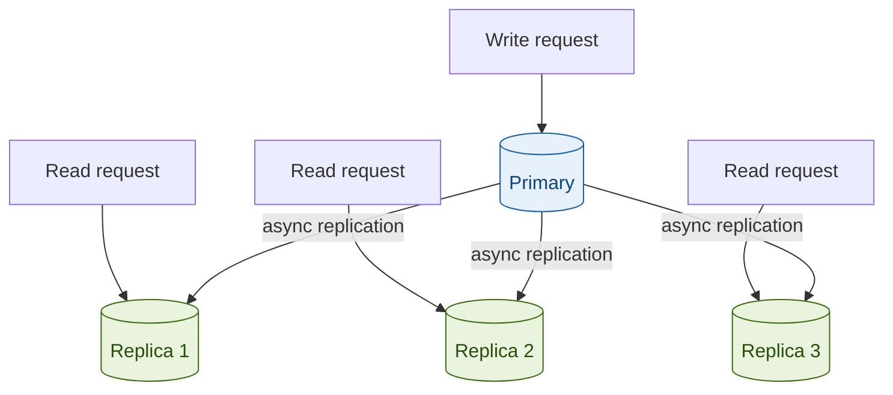
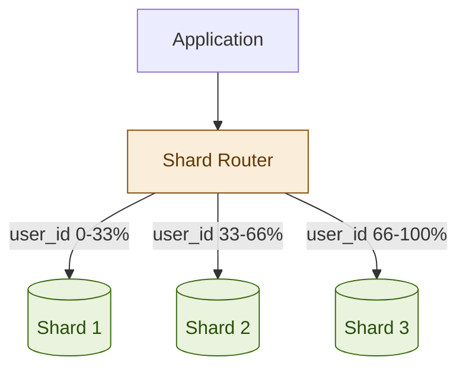

# System Design Foundations

> **Purpose:** Core concepts that underpin every system design interview.  
> **Rule:** Every design decision must be justified using one or more of these concepts.  
> **Format:** Diagrams where spatial relationships matter. Tables and prose elsewhere.

---

## Table of Contents

1. [CAP Theorem](#1-cap-theorem)
2. [PACELC — The Extension of CAP](#2-pacelc--the-extension-of-cap)
3. [Consistency Models](#3-consistency-models)
4. [SQL vs NoSQL](#4-sql-vs-nosql)
5. [Caching Strategies](#5-caching-strategies)
6. [Load Balancing](#6-load-balancing)
7. [Message Queues](#7-message-queues)
8. [CDN](#8-cdn)
9. [DNS Internals](#9-dns-internals)
10. [Database Sharding and Replication](#10-database-sharding-and-replication)
11. [The System Design Framework](#11-the-system-design-framework)

---

## 1. CAP Theorem

A distributed system can guarantee **at most two** of three properties simultaneously:

| Property | Meaning |
|---|---|
| **C — Consistency** | Every read receives the most recent write or an error. All nodes see the same data at the same time. |
| **A — Availability** | Every request receives a response (not necessarily the latest data). System is always operational. |
| **P — Partition tolerance** | System continues operating even when network messages between nodes are dropped or delayed. |



### The real-world constraint

**Network partitions are not optional** — they will happen in any distributed system. So the real choice is always **CP** or **AP**. CA systems only exist on a single machine.

### Scenario decision map

| Scenario | Choice | Reason |
|---|---|---|
| Bank transfer / payments | **CP** | Stale read = money appears in two accounts simultaneously |
| DNS resolution | **AP** | Slightly stale IP is far better than no answer |
| Shopping cart | **AP** | Merge cart conflicts at checkout; don't block the shopping experience |
| Social media like counter | **AP** | Approximate count is acceptable |
| Domain availability check | **AP** (check) + **CP** (registration write) | Fast check OK; actual registration must be atomic |
| Distributed config (etcd) | **CP** | Half the fleet running with an old DB password = catastrophic failure |

### Interview sentence

> "Network partitions aren't optional — they will happen. The real choice is always CP vs AP. I'd choose CP here because a stale read causes [specific harm]. I'd choose AP here because eventual convergence is acceptable because [reason]."

---

## 2. PACELC — The Extension of CAP

CAP only describes behaviour **during a partition**. PACELC also addresses normal operation:

- **If Partition** → choose between **A**vailability and **C**onsistency
- **Else** (normal operation) → choose between **L**atency and **C**onsistency

This matters because even without a partition, replication has a latency cost.

| Category | Systems | Trade-off |
|---|---|---|
| **PA/EL** — high availability + low latency | DynamoDB, Cassandra, CouchDB | Sacrifice consistency for speed and uptime |
| **PC/EC** — strong consistency | HBase, Zookeeper, etcd, Spanner | Pay latency for correctness |

---

## 3. Consistency Models

From **strongest** to **weakest**:

### Linearizability (strongest)
All operations appear atomic at a single point in real time. Global ordering matches wall-clock time.  
**Used by:** etcd, Google Spanner.

### Strong consistency
After a write completes, every subsequent read from any node returns that value. Achieved via single primary or quorum reads.  
**Used by:** PostgreSQL with synchronous replication, Zookeeper.  
**When:** financial transactions, inventory counts — anything where stale reads cause real-world harm.

### Sequential consistency
All nodes see operations in the same order — but that order need not match wall-clock time.

### Causal consistency
Causally related operations are seen in the same order everywhere. Independent operations may appear in different orders on different nodes.  
**Used by:** MongoDB causal sessions, collaborative editing systems.

### Read-your-writes (session consistency)
A client always sees its own writes immediately after making them, even if other clients may see stale data temporarily.  
**Required by:** virtually all user-facing web applications.  
**Implementation:** route same session's reads to same replica, or track write timestamp in session token.

### Eventual consistency (weakest)
All replicas will converge given no new writes. Reads may return stale data during the convergence window (milliseconds to seconds typically).  
**Used by:** DNS, CDN caches, DynamoDB default, Cassandra default, social media counters.  
**Conflict resolution strategies:** LWW (last-write-wins), CRDTs, application-level merge logic.

### Interview one-liner

> "Strong consistency: after a write, every read returns that value — costs latency, all replicas must agree. Eventual consistency: replicas converge over time but reads may be stale — much faster, acceptable when approximate values are fine (like counts, view counts, DNS TTLs)."

---

## 4. SQL vs NoSQL

### Decision framework

```
Need complex JOINs or ACID multi-table transactions?   → SQL (PostgreSQL, MySQL)
Simple key-value lookups, caching, sessions?           → Key-value (Redis, DynamoDB)
Flexible/nested schema, variable attributes?           → Document (MongoDB, Firestore)
Write-heavy, time-ordered, massive horizontal scale?   → Wide-column (Cassandra, HBase)
Relationship traversal is the core operation?          → Graph (Neo4j, Neptune)
Time-series metrics, IoT, monitoring?                  → TimescaleDB, InfluxDB
```

### Comparison

| Type | Examples | Strengths | Weaknesses | Use for |
|---|---|---|---|---|
| **SQL** | PostgreSQL, MySQL | ACID, complex queries, rich indexing | Hard to scale writes horizontally | Users, orders, payments |
| **Key-value** | Redis, DynamoDB | O(1) get/set, extreme throughput | No joins, must know key upfront | Cache, sessions, rate limiting |
| **Document** | MongoDB, Firestore | Flexible schema, nested data | No native joins, eventual consistency | User profiles, CMS, catalogs |
| **Wide-column** | Cassandra, HBase | Massive write scale, time-ordered | Query patterns defined upfront, no joins | Logs, activity feeds, IoT |
| **Graph** | Neo4j, Neptune | Relationship traversal O(edges not rows) | Not general purpose | Social graphs, fraud detection |

### Interview warning

> "The common mistake: 'I'd use MongoDB because NoSQL scales better.' Scale depends on access patterns, not the database type. PostgreSQL with read replicas scales reads very effectively. I choose based on the specific access patterns and consistency requirements."

---

## 5. Caching Strategies

### Caching layers — mention all in any design



### Cache-aside (lazy loading) — most common



✅ Only caches what is actually requested. Cache failure just means slower reads.  
❌ Cache miss = 3 round trips. Cold start is slow. Stale if DB is updated externally.  
**Use for:** read-heavy workloads, URL redirects, domain lookups.

### Write-through — strong consistency



✅ Cache never stale. Reads always fast after the first write.  
❌ Write latency doubles (must write both). Cache fills with data that may never be read.  
**Use for:** payment state, user balances, anything that must always be fresh on read.

### Write-behind (write-back) — high write throughput



✅ Lowest write latency. Absorbs write spikes. Good for counters.  
❌ Data loss risk if cache fails before flush. Not suitable for ACID requirements.  
**Use for:** analytics counters, like counts, view counts.

### Eviction policies

| Policy | When to use |
|---|---|
| **LRU** (least recently used) | Default choice. Good when recent access predicts future access. |
| **LFU** (least frequently used) | Stable popularity patterns. Old trending content evicted. |
| **TTL** (time to live) | Always combine with other policies. Prevents stale data. |
| **FIFO / Random** | Use only when access patterns are completely unknown. |

### Asymmetric TTL — a senior detail

Different states deserve different TTLs based on how quickly they can change:

```
Domain taken     → TTL 1 hour    (rarely becomes available — expiry takes weeks)
Domain available → TTL 5 min     (can become taken at any moment)

Tweet content    → TTL 24 hours  (rarely changes)
User presence    → TTL 5 min     (changes frequently)
```

---

## 6. Load Balancing

### L4 vs L7

```mermaid
graph TD
    subgraph L4["L4 — Transport Layer"]
        L4LB[L4 Load Balancer\nRoutes on IP + Port]
        S1[Server 1]
        S2[Server 2]
        S3[Server 3]
        L4LB --> S1
        L4LB --> S2
        L4LB --> S3
    end

    subgraph L7["L7 — Application Layer"]
        L7LB[L7 Load Balancer\nRoutes on URL path / headers / cookies]
        API[/api/* → API Service]
        Static[/static/* → CDN]
        WS[WebSocket → WS Service]
        L7LB --> API
        L7LB --> Static
        L7LB --> WS
    end

    style L4 fill:#E6F1FB,stroke:#185FA5
    style L7 fill:#EAF3DE,stroke:#3B6D11
```

| | L4 (Transport) | L7 (Application) |
|---|---|---|
| **Routes on** | IP + TCP/UDP port | HTTP headers, URL path, cookies, content type |
| **Speed** | Faster — no packet inspection | Slower — full packet inspection |
| **Features** | Raw routing | SSL termination, path routing, A/B testing, request rewriting |
| **Use for** | Non-HTTP protocols, raw TCP/UDP | Microservices, HTTP APIs |

### Balancing algorithms

| Algorithm | How it works | Best for |
|---|---|---|
| **Round robin** | Rotate through servers in order | Identical servers, simple default |
| **Weighted round robin** | Higher-capacity servers get proportionally more | Heterogeneous fleets |
| **Least connections** | New request → server with fewest active connections | Variable-duration requests (WebSocket, streaming) |
| **IP hash / sticky** | Same client IP → same server every time | Session state not shared across servers |
| **Power of two choices** | Pick 2 servers randomly, send to the less busy one | Near-optimal, very simple to implement |

### Health checks

Load balancer continuously pings `/health` endpoint on each backend. Fail N consecutive checks → remove from rotation. Healthy again → re-add. This is the mechanism behind zero-downtime deploys — drain the old instance, bring up the new one.

---

## 7. Message Queues

### When to use a queue



| Scenario | Why a queue helps |
|---|---|
| **Async processing** | Return immediately, process in background (video transcoding, email sending) |
| **Load levelling** | Absorb traffic spikes; workers drain at a steady rate |
| **Fan-out** | One event triggers multiple independent consumers |
| **Fault tolerance** | Consumer down → messages queue up, process when it recovers |
| **Decoupling** | Producer doesn't need to know about consumers |

### Kafka vs RabbitMQ

| | Kafka | RabbitMQ |
|---|---|---|
| **Model** | Immutable append-only log | Traditional queue (message deleted after ACK) |
| **Retention** | Days / weeks (configurable) | Until acknowledged |
| **Consumer model** | Consumer groups — each reads independently | Competing consumers — one processes each message |
| **Throughput** | Millions of messages/sec | Thousands of messages/sec |
| **Best for** | Event sourcing, analytics pipelines, audit logs, high throughput | Task queues, RPC-style jobs, notifications, simpler setup |

### Delivery guarantees

| Guarantee | Behaviour | Use for |
|---|---|---|
| **At-most-once** | 0 or 1 deliveries — may be lost | Metrics where losing occasional events is acceptable |
| **At-least-once** | 1 or more deliveries — may duplicate | Most cases — consumer must be idempotent |
| **Exactly-once** | Delivered exactly once | Payments, financial transactions |

**Dead letter queue (DLQ):** messages that fail to process after N retries are moved here. Prevents one bad message from blocking the entire queue forever. Always configure a DLQ in production.

---

## 8. CDN

### How a CDN works



### Pull CDN vs Push CDN

| | Pull CDN | Push CDN |
|---|---|---|
| **Mechanism** | Edge fetches from origin on first cache miss | You proactively push content to edge nodes |
| **Setup** | Zero configuration | Must manage what content to push |
| **First request latency** | Slightly slower (origin fetch) | Instant — already at edge |
| **Best for** | Unpredictable access patterns, most use cases | Large predictable files (software releases, known viral content) |

### Cache-Control headers for CDN

```http
Cache-Control: max-age=31536000, immutable    # static assets with versioned filenames
Cache-Control: max-age=3600                   # semi-static content (updated hourly)
Cache-Control: no-cache                       # must revalidate before serving
Cache-Control: no-store                       # never cache (private, personalised)
```

### When CDN is the architecture (not just an optimisation)

At YouTube's scale (46 Tbps) or Twitter's media scale, no origin cluster can serve the bandwidth. The CDN is not an add-on — it IS the read architecture. Origin only handles cache misses and new content ingestion.

---

## 9. DNS Internals

### The resolution chain



### DNS Record Types

| Record | Maps | Example |
|---|---|---|
| **A** | hostname → IPv4 address | `example.com → 93.184.216.34` |
| **AAAA** | hostname → IPv6 address | Same for IPv6 |
| **CNAME** | hostname → hostname (alias) | `www.example.com → example.com` |
| **MX** | domain → mail server hostname | Routes incoming email |
| **NS** | domain → authoritative nameserver | Which server is authoritative |
| **TXT** | domain → arbitrary text | SPF, DKIM, domain ownership verification |

### TTL and propagation

Lower TTL = faster change propagation but more queries to the authoritative server.

**Best practice for DNS changes:** lower TTL to 300s (5 min) 24 hours before a planned change, make the change, then restore the original TTL. This minimises the propagation window.

### CNAME at root domain — illegal per DNS spec

A CNAME at the naked domain (apex record) is not permitted — the root must be an A record. This is why AWS Route 53 has ALIAS records and Cloudflare has CNAME flattening — they resolve the indirection server-side and return an A record.

---

## 10. Database Sharding and Replication

### Replication — scale reads



**Primary-replica:** one primary handles all writes, multiple replicas handle reads. Replication is async — reads may be slightly stale.  
✅ Scale read throughput linearly by adding replicas.  
❌ Write bottleneck remains — single primary.

**Multi-primary:** multiple primaries accept writes. Requires conflict resolution strategy.  
✅ High write throughput, multi-region active-active.  
❌ Conflict resolution complexity. Use only when single-primary write throughput is genuinely exhausted.

### Sharding — scale writes



Splits data across multiple database instances. Each shard owns a partition of the data and handles reads/writes for that partition only.

| Strategy | How | Pros | Cons |
|---|---|---|---|
| **Hash sharding** | `shard = hash(key) % N` | Uniform distribution | No range queries across shards |
| **Range sharding** | A-M → shard 1, N-Z → shard 2 | Range queries work naturally | Hot shards if distribution is uneven |
| **Directory sharding** | Lookup table maps key → shard | Most flexible, supports any distribution | Extra hop adds latency |
| **Consistent hashing** | Virtual nodes on a ring | Adding/removing shards remaps only a fraction of keys | More complex to implement |

### Sharding trade-offs — always mention these

- Cross-shard queries require scatter-gather — expensive
- JOINs across shards are nearly impossible — must denormalise or avoid
- Re-sharding is painful — design the shard key for future growth from day one
- Hotspot problem — one popular user routes all traffic to a single shard regardless of hash function

### The senior recommendation

> "I'd start with a single primary and read replicas. Only add sharding when a single primary cannot handle write throughput — which happens much later than most people think. Premature sharding is one of the most expensive architectural mistakes in distributed systems."

---

## 11. The System Design Framework

Apply this structure to every question. 45-60 minutes total.

### Step 1 — Requirements clarification (5 min)

Always ask before touching the whiteboard:

```
Functional:     What features must the system have? Top 3-4 only.
Non-functional: Scale (DAU, QPS), latency SLAs, availability (99.9% vs 99.99%),
                durability, consistency model
Out of scope:   What can I explicitly ignore? State it.
```

### Step 2 — Capacity estimation (5 min)

Always show the math. Interviewers want to see structured numerical reasoning.

```
QPS:        requests/day ÷ 86,400 = baseline QPS
            Peak = 3-10× baseline

Storage:    records/day × avg_record_size × 365 = annual storage

Bandwidth:  QPS × avg_response_size = outbound bandwidth

Cache size: total_data × hot_data_fraction (usually 20%) = cache needed
```

### Step 3 — High-level design (10 min)

Draw the boxes: clients → load balancer → services → databases → caches.  
Walk through the happy path end-to-end.  
Identify the primary read path and write path separately.

### Step 4 — Component deep-dive (15 min)

Pick the 2-3 most complex components. For each: schema, API design, key algorithm, data structure choices. This is where LLD appears within HLD.

### Step 5 — Scale and reliability (10 min)

Identify bottlenecks at 10× current scale. For each component:
- How does it fail? What is the blast radius?
- DB: replicas for reads, sharding for writes
- Cache: eviction strategy, stampede prevention
- Services: horizontal scaling, circuit breakers, graceful degradation
- Network: CDN for static, rate limiting for abuse prevention

### Step 6 — Trade-offs (5 min)

Every major decision has a trade-off. State it explicitly:

> "I chose X over Y because [specific reason]. The trade-off is [what I give up], which is acceptable in this context because [why]."

### Senior differentiators checklist

- [ ] Ask clarifying questions before drawing anything
- [ ] State the data structure choice before writing code
- [ ] Mention distributed/multi-instance implications proactively
- [ ] Use correct HTTP semantics (410 vs 404, 429 vs 503, 302 vs 301)
- [ ] Mention idempotency for all write operations
- [ ] State when eventual consistency is the right answer and justify it
- [ ] Name the trade-off for every major design decision
- [ ] Mention the failure mode for every component

---
