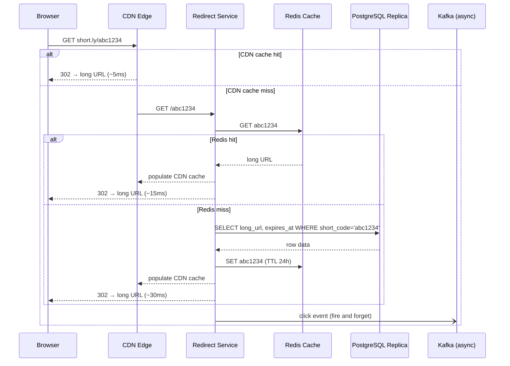

# System Design — URL Shortener (TinyURL / Bitly)

> **Difficulty:** Entry-to-mid level HLD. Good warm-up question.  
> **Key insight:** Read path (120K redirects/sec) and write path (1.2K creates/sec) are completely asymmetric — design them separately.  
> **What interviewers test:** Short code algorithm, 301 vs 302 semantics, three-layer caching, analytics decoupling, 410 vs 404.

---

## Table of Contents

1. [Requirements](#1-requirements)
2. [Capacity Estimation](#2-capacity-estimation)
3. [High-Level Design](#3-high-level-design)
4. [Shortening Algorithm](#4-shortening-algorithm)
5. [Redirect Flow](#5-redirect-flow)
6. [Database Schema](#6-database-schema)
7. [Scale and Reliability](#7-scale-and-reliability)
8. [Trade-offs](#8-trade-offs)
9. [Interview Script](#9-interview-script)
10. [Follow-up Probes and Answers](#10-follow-up-probes-and-answers)

---

## 1. Requirements

### Functional
- User submits a long URL → receives a short URL (e.g. `short.ly/abc1234`)
- Visiting the short URL redirects to the original long URL
- Custom aliases: user can request a specific short code (`short.ly/mylink`)
- Optional expiration date per URL
- Basic analytics: click count per short URL (not real-time)

### Non-functional
- High availability — redirects are revenue-critical, must never be down
- Low latency — redirect in under 100ms globally
- Durability — short URLs never disappear until explicitly expired or deleted
- Scale: 100M URLs created per day, read:write ratio ~100:1

### Out of scope
- User authentication and account management
- Real-time analytics dashboard
- Link preview / OG tag extraction

---

## 2. Capacity Estimation

```
Writes:
  100M URLs/day ÷ 86,400 sec = 1,157 writes/sec
  Peak (3×):                  ~3,500 writes/sec

Reads (redirects):
  100:1 read:write ratio      = 115,700 reads/sec
  Peak:                       ~350,000 reads/sec

Short code length:
  62^7 = 3.5 trillion combinations → 7 chars sufficient for decades

Storage per URL:  ~500 bytes (long URL + short code + metadata)
Annual storage:   100M × 365 × 500B = ~18 TB/year

Cache sizing (Pareto — top 20% URLs = 80% of traffic):
  100M active URLs × 20% × 500B = ~10 GB → fits in a single Redis cluster
```

---

## 3. High-Level Design

```
WRITE PATH                                READ PATH (100× more traffic)
──────────────────────────────────────    ──────────────────────────────────────

Client                                    User Browser
  │                                         │
  ▼                                         ▼
Load Balancer (L7, SSL termination)       CDN Edge (Cloudflare / Fastly)
  │                                         │  cache hit  → 302 in ~5ms
  ▼                                         │  cache miss ↓
URL Shortener Service                     Redirect Service
  │  - validate long URL                    │
  │  - generate short code                  ├──▶ Redis Cache
  │  - check custom alias availability      │    hit  → 302 in ~15ms
  │                                         │    miss ↓
  ├──▶ ID Generator (Snowflake IDs)         ├──▶ PostgreSQL Read Replica
  │                                         │    → 302 in ~30ms
  ▼                                         │
PostgreSQL Primary (writes only)           ├──▶ Kafka (async, fire-and-forget)
  │                                              │
  └──async replication──▶ Read Replica ×3        ▼
                                           Analytics Consumer
                                           (ClickHouse / BigQuery)
                                           NEVER in the redirect path
```

**Key principle:** write path and read path are separate services. Primary only handles writes (~1,200/sec). Analytics is always async — never blocks a redirect.

---

## 4. Shortening Algorithm

Three approaches. Know all three and be able to explain why the third is correct.

### Approach 1 — MD5 hashing (reject this)

```typescript
// MD5("https://example.com/very-long-path") → "a9b3c7d8e2f1..."
// Take first 7 chars → "a9b3c7d"
```

**Problems:**
- Different URLs can produce the same 7-char prefix → collision
- Same long URL always maps to the same short code — cannot create two distinct short URLs for the same destination
- Must query DB to check for collisions on every generation — no uniqueness guarantee by construction

### Approach 2 — Random Base62 string (acceptable, not ideal)

```typescript
function generateCode(): string {
  const chars = 'abcdefghijklmnopqrstuvwxyzABCDEFGHIJKLMNOPQRSTUVWXYZ0123456789';
  return Array.from({ length: 7 }, () =>
    chars[Math.floor(Math.random() * 62)]
  ).join('');
}
```

**Problems:**
- Must check DB for collision on every generation
- As the table fills, collision probability grows — at 50% fill ~1 in 2 codes already exist
- Retry loops become expensive at scale

### Approach 3 — Auto-increment ID + Base62 encoding (recommended)

```typescript
// Step 1: obtain a globally unique integer (DB auto-increment or Snowflake ID)
// e.g. ID = 123456789

const CHARS = 'abcdefghijklmnopqrstuvwxyzABCDEFGHIJKLMNOPQRSTUVWXYZ0123456789';

function toBase62(id: number): string {
  let result = '';
  while (id > 0) {
    result = CHARS[id % 62] + result;
    id = Math.floor(id / 62);
  }
  return result.padStart(7, 'a'); // always 7 chars
}

// 123456789 → "BFXPFp" → padded → "aBFXPFp"
// Guaranteed unique — unique integer = unique code, by construction
```

**Why this is correct:**
- Zero collisions — uniqueness of integer guarantees uniqueness of code
- No DB check needed — no retry logic
- Deterministic: O(log₆₂ n) encoding
- 62^7 = 3.5 trillion codes before exhaustion

**Caveat:** sequential IDs produce sequential, guessable codes.  
**Mitigation:** use Snowflake IDs — appear non-sequential but are still globally unique.

### Snowflake ID structure

```
 63                22 21          12 11           0
  ┌────────────────┬──────────────┬───────────────┐
  │   41 bits      │   10 bits    │   12 bits     │
  │   timestamp    │  machine ID  │   sequence    │
  └────────────────┴──────────────┴───────────────┘

41 bits timestamp = ~69 years from custom epoch
10 bits machine   = 1,024 unique machines
12 bits sequence  = 4,096 IDs per millisecond per machine
Total capacity    = ~4M unique IDs per millisecond across the cluster
```

### Custom alias handling

```typescript
// POST /api/v1/urls { long_url: "...", custom_alias: "mylink" }

// 1. Validate: alphanumeric only, 3-50 chars, not a reserved word
// 2. Check availability: SELECT 1 FROM urls WHERE short_code = 'mylink'
// 3. If taken  → return 409 Conflict
// 4. If free   → insert using custom alias instead of generated code
// 5. Rate-limit custom aliases more strictly — common abuse and squatting vector
```

---

## 5. Redirect Flow

### 301 vs 302 — a critical interview decision

| | 301 Moved Permanently | 302 Found (Temporary) |
|---|---|---|
| **Browser caches** | Yes — permanently | No |
| **Analytics** | Lost — browser bypasses servers | Tracked — every visit hits servers |
| **Can update destination** | No — cached forever | Yes |
| **Can expire URL** | No | Yes |
| **Server load** | Near-zero after first visit | Full traffic every visit |

**Rule:** use 302 for any URL shortener that needs analytics, expiry, or mutability. Use 301 only when zero server load is the explicit goal and analytics are irrelevant.

### Full redirect sequence (Mermaid — renders on GitHub web)



### Full redirect flow — ASCII (works everywhere)

```
Browser → GET short.ly/abc1234
            │
            ▼
         CDN Edge
            ├── CACHE HIT  ──────────────────────▶ 302 to long URL   (~5ms)
            │
            └── CACHE MISS
                    │
                    ▼
            Redirect Service
                    │
                    ▼
               Redis Cache
                    ├── HIT ──▶ populate CDN cache ──▶ 302            (~15ms)
                    │
                    └── MISS
                            │
                            ▼
                    PostgreSQL Read Replica
                    (SELECT WHERE short_code = ?)
                            │
                            ▼
                    populate Redis (TTL 24h)
                    populate CDN cache
                    → 302 to long URL                                  (~30ms)
                            │
                    Kafka click event ──▶ Analytics Consumer
                    (async, fire-and-forget — never blocks the redirect)
```

### Expiry check

```
IF expires_at IS NOT NULL AND expires_at < NOW():
    return 410 Gone      ← NOT 404

410 Gone    = resource existed and is intentionally, permanently gone
404 Not Found = resource never existed or location is unknown

Expired short URLs must return 410.
Signals to search engine crawlers not to retry.
Using 404 for expired URLs is a common mistake and wrong HTTP semantics.
```

---

## 6. Database Schema

```sql
-- Primary URL table
CREATE TABLE urls (
  id          BIGSERIAL       PRIMARY KEY,           -- drives Base62 encoding
  short_code  VARCHAR(16)     NOT NULL UNIQUE,        -- generated code OR custom alias
  long_url    TEXT            NOT NULL,               -- original URL, up to 2048 chars
  user_id     BIGINT,                                 -- nullable — anonymous creation allowed
  created_at  TIMESTAMPTZ     NOT NULL DEFAULT NOW(),
  expires_at  TIMESTAMPTZ,                            -- NULL = never expires
  is_custom   BOOLEAN         DEFAULT FALSE           -- true for custom aliases
);

-- Redirect lookup — always by short_code, must be fast
CREATE UNIQUE INDEX idx_short_code ON urls(short_code);   -- B-tree, O(log n)

-- User dashboard: list URLs belonging to a user
CREATE INDEX idx_user_created ON urls(user_id, created_at DESC);

-- Expiry cleanup job — partial index only covers rows with expiry set
CREATE INDEX idx_expires ON urls(expires_at) WHERE expires_at IS NOT NULL;


-- Analytics table — SEPARATE, never joined into the redirect hot path
CREATE TABLE clicks (
  id          BIGSERIAL     PRIMARY KEY,
  short_code  VARCHAR(16)   NOT NULL,
  clicked_at  TIMESTAMPTZ   NOT NULL DEFAULT NOW(),
  referrer    TEXT,                                   -- HTTP Referer header
  user_agent  TEXT,
  country     CHAR(2)                                 -- derived from IP geolocation
);

CREATE INDEX idx_clicks_code_time ON clicks(short_code, clicked_at DESC);
```

### Why analytics is a separate table

The clicks table grows at ~120K rows/sec. If co-located with the urls table, it thrashes the buffer pool and degrades every redirect query. Write click events asynchronously to Kafka and aggregate offline in ClickHouse or BigQuery. The redirect path must never block on an analytics write.

---

## 7. Scale and Reliability

### Three-layer read cache

```
                         READ PATH CACHE LAYERS
                         ──────────────────────

Browser ──▶ CDN Edge ──▶ Redirect Service ──▶ Redis ──▶ PostgreSQL Replica
              │                                 │               │
           ~60% of                           ~20% of        ~20% of
           requests                          requests       requests
           served here                       served here    served here
           (~5ms)                            (~15ms)        (~30ms)

PostgreSQL Primary: WRITES ONLY (~1,200/sec — trivial load)
```

### ID generation options

| Option | Throughput | Pros | Cons | Recommendation |
|---|---|---|---|---|
| **DB BIGSERIAL** | ~50K/sec | Zero extra infra, simple | Single primary bottleneck for ID generation | Start here |
| **Snowflake IDs** | ~4M IDs/ms | No central coordinator, timestamp-embedded, non-sequential | More complex setup | Switch when BIGSERIAL is the bottleneck |

### Cache stampede prevention for viral URLs

When a hot URL's Redis TTL expires, many concurrent requests simultaneously miss cache and hit the DB — the "thundering herd."

```
Problem:
  URL with TTL expires at T
  10,000 concurrent requests all miss cache at T
  All 10,000 query the DB simultaneously
  DB falls over

Solution 1 — Probabilistic early expiration:
  if (TTL < 5min && random() < 0.1):
    background_refresh_from_db()    ← non-blocking, 10% chance triggers refresh early

Solution 2 — Distributed lock on miss:
  lock = redis.SETNX("lock:shortCode", 1, EX=5)
  if lock:
    data = db.query(shortCode)
    redis.setex(shortCode, 86400, data)
    redis.del("lock:shortCode")
  else:
    sleep(100ms)                    ← another process is fetching — wait and retry
    return redis.get(shortCode)
```

### URL expiry cleanup

```sql
-- Background job — runs hourly during off-peak
-- Small LIMIT prevents long table locks
DELETE FROM urls
WHERE  expires_at < NOW()
  AND  expires_at IS NOT NULL
LIMIT  1000;

-- Partial index on expires_at makes this O(log n) not O(table size)
-- Repeat until 0 rows deleted
```

---

## 8. Trade-offs

### 301 vs 302

| | 301 | 302 |
|---|---|---|
| Server load after first visit | Near-zero (browser caches permanently) | Full — every redirect hits servers |
| Analytics | None — browser bypasses servers | Full click tracking |
| URL mutability | Impossible after browser caches | Yes — can update or expire |
| **When to use** | Static permanent links, zero server load is the goal | Any URL shortener with analytics or expiry |

### SQL vs NoSQL for URL storage

**Choose PostgreSQL because:**
- `UNIQUE` constraint on `short_code` is atomically enforced by the DB engine — no race condition possible
- Custom alias uniqueness requires a transactional check-then-insert
- Data model is well-defined and stable — no flexibility needed
- Operational simplicity — SQL is the right default when scale doesn't demand otherwise

**DynamoDB would also work** — the key-value access pattern fits naturally — but custom alias uniqueness becomes an application-level conditional put, which has a small race window under very high concurrency.

### Cache-aside vs write-through

**Choose cache-aside because:**
- Most short URLs are long-tail — created once, rarely or never accessed again
- Write-through would fill the cache with URLs that are never redirected — wasted memory
- A cache miss on first access is acceptable given the low write rate (~1,200/sec)

### Base62 + counter vs random string

**Choose Base62 + counter (Snowflake) because:**
- Zero collisions — unique integer = unique code by construction
- No retry logic, no DB round-trip per generation
- Predictability mitigated by Snowflake's non-sequential timestamp-based output

---

## 9. Interview Script

### Opening (2 min) — requirements first, always

> "Before I design anything — let me clarify requirements. Functional: create short URLs, redirect on visit, optional custom aliases, optional expiry, basic click analytics. Non-functional: high availability for redirects, sub-100ms globally, 100M creates per day with a 100:1 read ratio — so about 120,000 redirects per second. That asymmetry is the central design constraint."

### Core framing (1 min)

> "The key insight: write path and read path are completely asymmetric. Writes are ~1,200/sec and can tolerate 100ms. Redirects are 120,000/sec and need to complete in under 20ms globally. I'll design them as separate services with different scaling strategies."

### Algorithm (2 min)

> "For the short code — I won't use MD5 hashing: it has collision problems and permanently ties one long URL to one short code. I'll use auto-increment integer IDs encoded to Base62. A unique integer guarantees a unique code by construction — zero collisions, no retry logic. I'll use Snowflake IDs rather than a plain counter to avoid predictable sequential enumeration. 62^7 gives us 3.5 trillion codes."

### 301 vs 302 (1 min) — this always comes up

> "For redirects: 302 not 301. A 301 is permanently cached in the browser — zero server load after the first visit, but we lose all analytics and can never expire or update the URL. Those features require 302. One more detail: expired URLs return 410 Gone, not 404 — the resource existed and is intentionally removed. This tells crawlers not to retry."

### Scaling (2 min)

> "120K reads/sec through three caching layers: CDN edge serves roughly 60% — the 302 response itself is cached at the edge. Redis serves another 20% — short_code to long_url map with 24-hour TTL. PostgreSQL read replicas handle the remaining 20% cold misses. The primary only sees writes — about 1,200/sec, trivial."

### Proactive trade-offs (1 min)

> "Two trade-offs worth stating: cache-aside means the first redirect after creation hits the DB — I accept that, most URLs are long-tail and write-through wastes cache space. For viral URLs I'd add probabilistic early expiration to prevent stampede — 10% chance of background refresh when TTL falls below 5 minutes."

---

## 10. Follow-up Probes and Answers

**"How would you scale to multiple regions?"**  
Active-active with regional read replicas. Snowflake IDs are globally unique regardless of which region generates them — the machine ID bits differentiate regions. CDN already handles geographic read distribution. Writes route to the nearest regional primary and async-replicate globally.

**"How do you prevent abuse — spam links, phishing URLs?"**  
Rate limiting per IP and per user (token bucket). Async malware/phishing scanning via Google Safe Browsing API — scan after creation, flag and remove if malicious. Require account creation for custom aliases. Blacklist known spam domain patterns at the validation layer.

**"How would you handle analytics at scale?"**  
Async Kafka pipeline — redirect service publishes click events fire-and-forget. Analytics consumer aggregates into ClickHouse or BigQuery. Displayed counts are eventually consistent — "1.2K clicks" not "1,247 clicks" — that approximation is intentional product design, not a technical limitation.

**"Why not just use DynamoDB?"**  
It works well — key-value is the pattern. The trade-off: `UNIQUE` constraint on custom aliases becomes a conditional put in DynamoDB, which has a small race condition window under very high concurrency. PostgreSQL's unique index handles this atomically. At 1,200 writes/sec SQL is not the bottleneck, so there's no pressure to use NoSQL.

**"What happens when a URL is deleted?"**  
Soft delete — set `deleted = true`. Purge from Redis immediately. Purge from CDN via the purge API. Any subsequent request returns 410 Gone. Background job hard-deletes soft-deleted rows older than 30 days to reclaim storage.

**"What if the same long URL is shortened multiple times?"**  
Two valid approaches: (1) allow duplicates — each call creates a new short code. Simple, and users sometimes want different short codes for the same destination for tracking purposes. (2) deduplication — hash the long URL, check existence, return existing code. For most systems, allow duplicates — simpler and more flexible.

---
