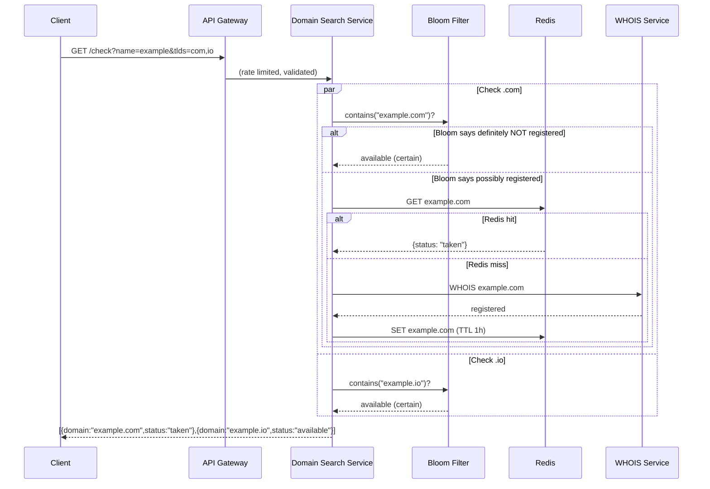

# System Design — Domain Availability Checker

> **Difficulty:** Mid-level HLD with domain-specific knowledge.  
> **Key insight:** The naive approach (WHOIS per search) hits registry rate limits immediately at scale. The entire architecture is built around NOT querying the registry for 85%+ of searches.  
> **What interviewers test:** Understanding of zone files, Bloom filters, asymmetric TTLs, the CP vs AP split between the check and the registration write.

---

## Table of Contents

1. [Requirements](#1-requirements)
2. [Capacity Estimation](#2-capacity-estimation)
3. [The Core Challenge](#3-the-core-challenge)
4. [High-Level Design](#4-high-level-design)
5. [Data Sources](#5-data-sources)
6. [Cache Architecture](#6-cache-architecture)
7. [Search Flow](#7-search-flow)
8. [Suggestions Engine](#8-suggestions-engine)
9. [Database Schema and API](#9-database-schema-and-api)
10. [Trade-offs](#10-trade-offs)
11. [Interview Script](#11-interview-script)
12. [Follow-up Probes and Answers](#12-follow-up-probes-and-answers)

---

## 1. Requirements

### Functional
- User types a domain name → system returns: available / taken / invalid
- Bulk check: check multiple TLDs simultaneously (`example.com`, `.net`, `.io`, `.co`)
- Suggestions: if `example.com` is taken, suggest `example.io`, `myexample.com`, etc.
- Typeahead: results update as user types — debounced, sub-200ms perceived latency
- Domain lifecycle states: available, taken, reserved, premium, pending_delete, redemption_period

### Non-functional
- Latency: sub-200ms — users abandon searches after ~300ms
- Freshness: showing "available" for a taken domain damages trust and loses a sale
- Scale: 50M searches per day
- High availability: the search page is a primary revenue entry point

### Out of scope
- Domain registration flow (acknowledge, don't design)
- Pricing engine
- DNS propagation after registration

---

## 2. Capacity Estimation

```
Searches/day:        50M → 580 searches/sec average
Peak (10× avg):      5,800 searches/sec
TLDs per search:     ~10 checked simultaneously per query
Total checks/sec:    58,000 at peak

WHOIS rate limit:    Verisign (.com) allows ~1,000 queries/sec per IP
Problem:             58,000 needed vs 1,000 available → WHOIS alone is 58× too slow
                     Cache hit rate must be 85%+ to stay within limits

Registry data size:  ~200M registered .com domains
                     ~1B total across all TLDs
Cache size needed:   200M domains × 100 bytes avg = ~20 GB
                     Fits in a Redis cluster
```

---

## 3. The Core Challenge

The naive design — query WHOIS for every search — fails immediately:

```
Problem 1: WHOIS rate limits
  Verisign (.com) limits to ~1,000 queries/sec per IP
  At 58,000 checks/sec needed → 58× over the limit
  Cannot be solved by adding more IPs — registries block this

Problem 2: WHOIS latency
  Single WHOIS query: 100–500ms
  10 TLDs in parallel: still limited by the slowest registry
  Sub-200ms target is impossible if every search hits WHOIS

Problem 3: Different registries per TLD
  .com  → Verisign
  .net  → Verisign
  .io   → NIC.io
  .co   → .CO Internet SAS
  Each has its own protocol, rate limits, and quirks

Solution: multi-layer caching + zone file synchronisation as the bulk data source
```

---

## 4. High-Level Design

```
REAL-TIME SEARCH PATH                    BACKGROUND SYNC PIPELINE
─────────────────────────────────────    ──────────────────────────────────────

Client (browser)                         ICANN Zone Files
  │  debounce 150ms                        │  .com = 12GB, updated nightly
  ▼                                        │  .net, .org, etc. same pattern
API Gateway                               ▼
  │  rate limit (100 req/min/IP)        Zone File Importer
  │  input validation                     │  parse → diff vs yesterday
  ▼                                        │  batch upsert changes
Domain Search Service                     ▼
  │  fan-out: all TLDs in parallel       Domain DB (PostgreSQL)
  │                                        │  200M+ registered domains
  ├──▶ Bloom Filter (250MB, in-memory)     ▼
  │     "definitely not registered"      Redis Cache Warmer
  │     → return available immediately     │  top 20M domains pre-loaded
  │                                        │
  ├──▶ Redis Cache                       Kafka Event Stream
  │     "maybe taken" → check map          │  register / expire events
  │     hit  → return status               │  (near-real-time updates for
  │     miss ↓                             │   domains registered right now)
  │                                        ▼
  └──▶ WHOIS Service (cache miss only)  Cache Invalidation Consumer
        100–500ms, rate-limited           → Redis updated within ~2 seconds
        reserved for cold lookups           for new registrations
        and pre-purchase verification
```

---

## 5. Data Sources

Three layers of truth — each with different freshness, coverage, and cost.

### Layer 1 — Zone files (bulk, periodic) — primary data source

ICANN mandates that all accredited registrars have access to zone files — flat text files listing every registered domain for a TLD. The .com zone file is ~12GB, updated nightly, with ~160M entries.

```
Process:
  1. Download zone file nightly (~12GB for .com alone)
  2. Parse the file (one domain per line)
  3. Diff against yesterday's snapshot
  4. Batch upsert only the changed rows to PostgreSQL
  5. Refresh Redis cache for newly registered and expired domains
  6. Rebuild Bloom filter from the updated domain set
```

| | Detail |
|---|---|
| Coverage | 95%+ of all registered domains |
| Freshness | Up to 24 hours stale |
| Rate limits | None — bulk file download |
| Cost | Free with ICANN accreditation |

**The gap:** a domain registered this morning won't appear until tomorrow's zone file. This is bridged by Layer 3.

### Layer 2 — WHOIS / RDAP (real-time, rate-limited) — freshness layer

WHOIS is the legacy text protocol. RDAP (Registration Data Access Protocol) is the modern JSON replacement. Both query the authoritative registry in real time.

```
Use WHOIS/RDAP only for:
  - Cache misses (domain not in our DB at all)
  - Pre-purchase verification (always do a live check before charging)
  - Reconciliation of edge cases
```

| | Detail |
|---|---|
| Freshness | Real-time, authoritative |
| Rate limits | ~1,000 queries/sec per IP (Verisign) |
| Latency | 100–500ms per query |
| Protocol | RDAP preferred, WHOIS fallback |

### Layer 3 — Kafka event stream (near-real-time) — cache invalidation

When a registration is processed internally, a Kafka event is published immediately. The cache invalidation consumer updates Redis within seconds — bridging the 24-hour zone file gap.

```
Registration event → Kafka → Cache consumer
  → redis.set("example.com", "taken")   within ~2 seconds
  → bloom_filter.add("example.com")
  → Prevents "available" flash for domains just purchased
```

---

## 6. Cache Architecture

### Bloom filter — first line of defence

A Bloom filter is a space-efficient probabilistic data structure:
- **Zero false negatives** — if it says "not registered," that is guaranteed correct
- **~1% false positive rate** — 1% of available domains get an unnecessary Redis lookup (acceptable)
- **250MB** stores 200M domains — tiny, lives entirely in application memory

```
Check: is "example.com" registered?
         │
         ▼
    Bloom Filter (250MB, in-memory)
         │
         ├── "DEFINITELY NOT registered"  →  return AVAILABLE immediately
         │   (zero false negatives)           no Redis round-trip needed
         │
         └── "POSSIBLY registered"
                  │
                  ▼
             Redis Cache
                  │
                  ├── HIT  →  return cached status
                  └── MISS →  live WHOIS query (rate-limited fallback)
```

The Bloom filter answers "definitely available" for the majority of novel searches instantly, without any Redis round-trip.

### Redis cache structure

```
# Key: full domain name
# Value: JSON status object
# TTL: asymmetric based on status

SET "example.com"    '{"status":"taken","since":"2005-03-12"}' EX 3600
SET "newdomain.io"   '{"status":"available","checked":1712345678}' EX 300
SET "rare-tld.xyz"   '{"status":"premium","price":4999}' EX 1800
```

### Asymmetric TTL — the critical design detail

```
Status              TTL        Reason
──────────────────────────────────────────────────────────────────
taken               1 hour     Taken domains rarely become available
                               (expiry + grace period takes weeks)

available           5 minutes  Can become taken at any moment
                               Must stay fresh — showing stale
                               "available" causes a failed sale

reserved            24 hours   Doesn't change often

premium             30 minutes Price can change, status rarely does

pending_delete      1 hour     Transitioning — will become available soon

redemption_period   1 hour     Owner has 30 days to reclaim
```

The asymmetry reflects the stakes: "available" for a taken domain = failed purchase = worst UX. "taken" for an available domain = minor inconvenience. Short TTL on available, long TTL on taken.

---

## 7. Search Flow

### Typeahead design

```
User types "exampl" → "example" → "example.c" → "example.co"
  │
  └── Client debounces: only fire request 150ms after last keystroke
      Reduces server load by ~70% vs per-keystroke queries
      Cancel in-flight request when new one starts (AbortController)

Client sends:
  GET /api/v1/domains/check?name=example&tlds=com,net,io,co,ai&limit=10

Per-TLD check (runs in parallel for all requested TLDs):
  Bloom filter → Redis → WHOIS (miss only)
  Each TLD check is completely independent

Return partial results as they arrive:
  Don't wait for slowest TLD
  Show .com result first, .io second, etc.
  Slow/failed TLDs show "checking..." not an error
```

### Fan-out with per-TLD timeout

```typescript
async function checkDomains(name: string, tlds: string[]) {
  const checks = tlds.map(tld => ({
    domain: `${name}.${tld}`,
    // Per-TLD timeout — don't let one slow registry hold up everything
    result: withTimeout(checkAvailability(`${name}.${tld}`), 2000),
  }));

  // allSettled — don't let one failed TLD block the others
  const results = await Promise.allSettled(checks.map(c => c.result));

  return results.map((r, i) => ({
    domain: checks[i].domain,
    // Timeout/error → show "checking..." not a red error
    status: r.status === 'fulfilled' ? r.value.status : 'checking',
  }));
}
```

**Why `Promise.allSettled` not `Promise.all`:** if the .io registry is slow, `Promise.all` holds back the entire response until .io resolves. `allSettled` returns all results including failures — a slow TLD shows "checking..." while others display immediately.

### Search request/response sequence (Mermaid — renders on GitHub web)



### Search flow — ASCII (works everywhere)

```
Client
  │  GET /check?name=example&tlds=com,io,co,net,ai
  ▼
API Gateway (rate limit + validate)
  │
  ▼
Domain Search Service
  │  fan-out all TLDs in parallel (Promise.allSettled)
  │
  ├── example.com ──▶ Bloom Filter
  │                       │
  │                       ├── "DEFINITELY NOT" ──▶ available (instant)
  │                       │
  │                       └── "POSSIBLY" ──▶ Redis
  │                                              │
  │                                              ├── HIT  ──▶ cached status
  │                                              └── MISS ──▶ WHOIS ──▶ cache result
  │
  ├── example.io  ──▶ (same pipeline)
  ├── example.co  ──▶ (same pipeline)
  ├── example.net ──▶ (same pipeline)
  └── example.ai  ──▶ (same pipeline)
         │
         ▼
  Merge results (return as each TLD resolves, don't wait for slowest)
         │
         ▼
  Suggestions service runs in parallel
  (returns while user is reading primary results)
```

---

## 8. Suggestions Engine

When the desired domain is taken, suggestions convert a lost visitor into a customer.

### Suggestion strategies (applied in priority order)

```
1. Alternative TLDs (highest conversion)
   example.com taken → try example.io, example.co, example.ai, example.dev
   Same brand, different extension

2. Prefix / suffix variations
   Dictionary of ~50 common tech patterns:
   get{name}.com, {name}hq.com, try{name}.com, use{name}.com,
   {name}app.com, my{name}.com, the{name}.com

3. Keyword additions
   {name}2025.com, {name}online.com, {name}web.com

4. Hyphenated variants (lower desirability)
   my-{name}.com, {name}-app.com

5. NLP synonym suggestions (offline, pre-computed)
   shop.com taken → store.com, market.com, boutique.com
   Uses pre-built synonym graph (WordNet or custom)
   Never computed in the real-time path
```

### Scoring and ranking

```typescript
function scoreSuggestion(s: DomainSuggestion): number {
  let score = 0;

  // TLD desirability (from historical registration/purchase data)
  const TLD_WEIGHTS: Record<string, number> = {
    com: 100, io: 80, ai: 75, co: 65, app: 60, dev: 55, net: 50,
  };
  score += TLD_WEIGHTS[s.tld] ?? 30;

  // Shorter = more memorable = better
  score -= s.domain.length * 2;

  // Exact brand name preserved (no prefix/suffix added) = bonus
  if (s.name === originalName) score += 30;

  // Premium domain = higher margin = boost in results
  if (s.isPremium) score += 20;

  return score;
}
```

**Precomputation for common terms:** for high-traffic search terms like "shop", "store", "app" — suggestions are precomputed during off-peak hours and cached. Novel brand names are computed live. This prevents suggestion generation from ever being in the hot path for popular queries.

---

## 9. Database Schema and API

### Core domain table

```sql
-- Domain registry table (populated from zone files + WHOIS lookups)
CREATE TABLE domains (
  id            BIGSERIAL       PRIMARY KEY,
  name          VARCHAR(63)     NOT NULL,         -- 'example'
  tld           VARCHAR(20)     NOT NULL,         -- 'com'
  full_domain   VARCHAR(255)    NOT NULL,         -- 'example.com'
  status        domain_status   NOT NULL,         -- see enum below
  registered_at TIMESTAMPTZ,
  expires_at    TIMESTAMPTZ,
  last_checked  TIMESTAMPTZ     NOT NULL DEFAULT NOW(),
  UNIQUE(name, tld)
);

-- domain_status enum:
-- 'available' | 'taken' | 'reserved' | 'premium'
-- 'pending_delete' | 'redemption_period' | 'error'

-- Primary lookup: always by full_domain
CREATE UNIQUE INDEX idx_full_domain ON domains(full_domain);

-- Expiry monitoring: find soon-to-expire domains
CREATE INDEX idx_expires ON domains(expires_at) WHERE status = 'taken';

-- Zone file import tracking
CREATE TABLE zone_file_imports (
  id                BIGSERIAL     PRIMARY KEY,
  tld               VARCHAR(20)   NOT NULL,
  imported_at       TIMESTAMPTZ   NOT NULL,
  records_processed BIGINT,
  records_changed   BIGINT,
  duration_seconds  INT
);
```

### Domain lifecycle states — a senior detail

Most candidates say only "available or taken." Knowing all six states shows you understand the business.

```
State               Meaning                           Action available
──────────────────────────────────────────────────────────────────────
available           Can be registered now             Register
taken               Registered by someone else        Backorder
reserved            Reserved by registry / ICANN      None
premium             Available at premium price        Register (expensive)
pending_delete      Domain expiring, will be free     Backorder / set alert
redemption_period   Expired, 30-day owner grace       Backorder (may reclaim)
```

`pending_delete` and `redemption_period` feed directly into backorder and auction products — high-value inventory.

### REST API design

```
# Single domain check
GET /api/v1/domains/availability?domain=example.com
→  { domain: "example.com", status: "taken", checkedAt: "2024-04-12T..." }

# Bulk check (up to 50 domains)
POST /api/v1/domains/availability/bulk
Body: { domains: ["example.com", "example.io", "example.co"] }
→  { results: [{ domain, status, price? }] }

# Suggestions for a taken domain
GET /api/v1/domains/suggestions?name=example&tld=com&limit=10
→  { suggestions: [{ domain, status, price, score }] }
```

---

## 10. Trade-offs

### Freshness vs performance

```
                    Long TTL           Short TTL
                    (1h for taken)     (5min for available)
                    ─────────────      ──────────────────────
WHOIS queries       Fewer              More (risk rate limits)
Latency             Lower (more hits)  Higher (more misses)
Stale data          More stale         Near real-time
Failed sale risk    Low                Very low

Resolution: asymmetric TTLs — long for taken, short for available
            + live WHOIS verification always before charging
```

### Bloom filter false positives vs negatives

```
False positive (says "maybe taken" when actually available):
  Rate: ~1%
  Result: extra Redis lookup
  Impact: minor — small latency overhead, acceptable

False negative (says "available" when actually taken):
  Rate: ZERO — Bloom filters cannot produce false negatives
  This is the invariant that makes Bloom filters correct for this use case

The Bloom filter maps perfectly to the requirement:
  Must never show "available" for a taken domain (zero false negatives ✓)
  Can tolerate 1% extra Redis lookups (false positives ✓)
```

### Zone files vs WHOIS as primary source

```
Zone files win:
  ✓ No rate limits
  ✓ Complete coverage (155M+ .com domains)
  ✓ Free with ICANN accreditation (competitive moat)
  ✓ Enables pre-warming the entire cache

WHOIS role:
  → Reserved for cold cache misses only
  → Required for pre-purchase confirmation (always live check before charging)
  → Not for every search
```

### Registration race condition — CP for the write

```
Domain availability check:  AP  →  fast, eventually consistent, serve from cache
Domain registration write:  CP  →  atomic, the registry enforces uniqueness

If two users simultaneously see "available" and both try to register:
  → One succeeds, one gets "Sorry, domain was just registered"
  → This is correct — check is loose, commit is strict
  → The alternative (blocking check) would make search unusably slow
```

---

## 11. Interview Script

### Opening — name the WHOIS problem immediately

> "The naive design — query WHOIS on every search — fails immediately. Verisign rate-limits WHOIS at ~1,000 queries per second per IP. At 50M searches per day, that's 580 searches per second average — but each search checks 10 TLDs, so we need 58,000 WHOIS queries per second. That's 58 times the rate limit. The entire architecture is built around not hitting the registry for 85 percent or more of queries."

### Zone files as the bulk data source

> "The primary data source is ICANN zone files — flat text files listing every registered domain for a TLD. The .com file is 12GB updated nightly with 160M entries. We download it nightly, diff against yesterday, and batch-upsert only the changes into PostgreSQL. This covers 95% of domains with no rate limits."

### Bloom filter — the key technical detail

> "I'd use a Bloom filter as the first cache layer. 200 million domains fits in about 250MB in memory. It has zero false negatives — if it says a domain is not registered, that is guaranteed correct. For the roughly 1% false positive rate, we fall through to Redis. This gives us instant responses for domains that are clearly available without any Redis round-trip."

### Asymmetric TTLs

> "Different TTLs for different states. Taken domains: 1 hour — a registered domain won't become available for weeks. Available domains: 5 minutes — it can become taken at any moment. Before a user registers, I always do a live WHOIS confirmation regardless of cache state — never charge for a domain without a fresh authoritative check."

### Domain lifecycle states

> "I'd model domain status as an enum with six states: available, taken, reserved, premium, pending_delete, and redemption_period. Pending_delete and redemption_period are actionable states that feed directly into backorder and auction products — that's real revenue from domains in transition."

### CP vs AP split

> "The availability check is AP — fast, served from cache, eventually consistent. The registration write is CP — the registry enforces uniqueness atomically. Two users can both see 'available' and try to register. One succeeds, the other gets an error. The check is loose, the commit is strict. Making the check CP would require live WHOIS on every search — we're back to the rate limit problem."

---

## 12. Follow-up Probes and Answers

**"How do you handle multi-region deployment?"**  
Zone files sync globally — all regions share the same nightly import. Redis clusters in each region (EU, US, APAC). Searches route to the nearest region for low latency. Writes (registrations) go to the single authoritative registry regardless of region. Cache invalidation via Kafka fans out to all regional Redis clusters. Pre-purchase WHOIS verification is always a live query to the global authoritative source.

**"What if the user types very fast — too many requests per second?"**  
Debounce client-side: fire request only 150ms after the last keystroke. Rate limit at the API Gateway: 100 requests per minute per IP. Client cancels in-flight requests when a new one starts (AbortController). This reduces server load by ~70% compared to per-keystroke queries.

**"How do you handle new TLDs like .app, .dev?"**  
The system uses a registry adapter pattern. Each TLD has a config entry: zone file URL, WHOIS/RDAP endpoint, rate limits, TTL recommendations. Adding a new TLD is a configuration change and a zone file import job — not a code change. The search service discovers TLDs from the config at startup.

**"How does the cache stay accurate when a domain registers right now?"**  
Three mechanisms: (1) internal registrations publish a Kafka event immediately — Redis updated in ~2 seconds. (2) Nightly zone file diff catches everything else within 24 hours. (3) Short TTL on available domains (5 minutes) limits the stale window for anything that falls through. Pre-purchase WHOIS confirmation is the final safety net.

**"What is the consistency model for the availability check?"**  
AP — fast, served from cache, eventually consistent. A domain registered elsewhere 30 seconds ago may still show as available. This is acceptable — the purchase flow includes a final live WHOIS check before charging. The window of incorrectness is bounded by the TTL (5 minutes max for available domains).

---
