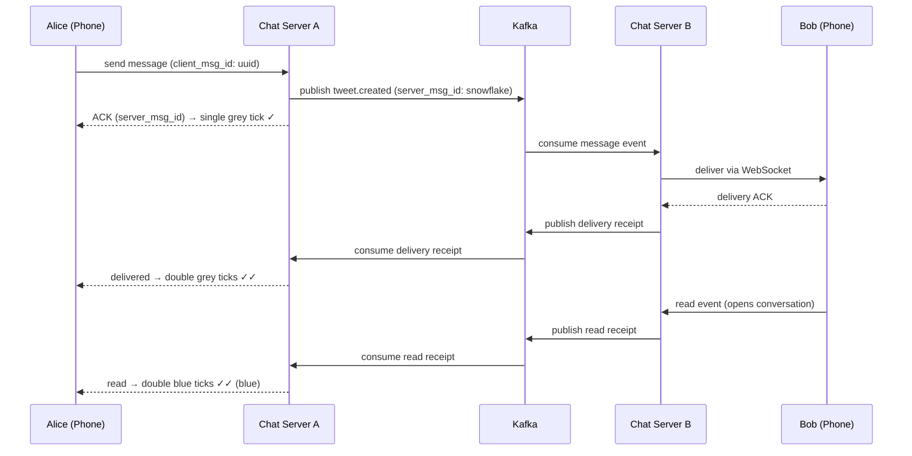

# System Design — WhatsApp (Real-Time Messaging)

> **Difficulty:** Hard HLD — real-time delivery, message ordering, offline queuing, group fan-out.  
> **Key insight:** This is NOT an HTTP request/response system. Every online user holds a persistent WebSocket connection to a chat server. Messages are pushed — never polled. This single constraint shapes every design decision.  
> **What interviewers test:** WebSocket vs polling, connection registry, delivery receipt state machine, group fan-out strategies, media separation.

---

## Table of Contents

1. [Requirements](#1-requirements)
2. [Capacity Estimation](#2-capacity-estimation)
3. [High-Level Design](#3-high-level-design)
4. [Connection Layer](#4-connection-layer)
5. [Message Flow — Online to Online](#5-message-flow--online-to-online)
6. [Offline Queuing and Sync](#6-offline-queuing-and-sync)
7. [Delivery Receipts](#7-delivery-receipts)
8. [Group Messaging](#8-group-messaging)
9. [Media Handling](#9-media-handling)
10. [Database Schema](#10-database-schema)
11. [Trade-offs](#11-trade-offs)
12. [Interview Script](#12-interview-script)
13. [Follow-up Probes and Answers](#13-follow-up-probes-and-answers)

---

## 1. Requirements

### Functional
- One-to-one messaging (text, images, video, documents)
- Group messaging (up to 1,024 members)
- Message delivery receipts: sent ✓, delivered ✓✓, read ✓✓ (blue)
- Online / last seen presence
- Push notifications for offline users
- Media upload and download

### Non-functional
- Scale: 2B users, 100B messages per day
- Latency: messages delivered in under 100ms for online users
- Durability: messages must never be lost in transit
- Ordering: messages in a conversation must arrive in order
- Availability: 99.99%

### Out of scope
- End-to-end encryption internals (acknowledge Signal protocol exists)
- Voice and video calls
- Payment features

---

## 2. Capacity Estimation

```
Messages/day:       100B → 1.16M messages/sec
Peak (3× avg):      ~3.5M messages/sec

Online users:       2B total, ~500M online at peak
Connections:        500M persistent WebSocket connections

Server capacity:    1 chat server handles ~65,000 WebSocket connections
Servers needed:     500M ÷ 65K = ~7,700 chat servers at peak

Text message size:  avg 100 bytes
Media:              images avg 100KB, video avg 10MB
                    ~10% of messages carry media
Media storage:      100B × 10% × 100KB = ~1 PB/day → S3 + CDN
```

---

## 3. High-Level Design

```
                              CONNECTION PLANE
                         (WebSocket servers — stateful)
                              ┌─────────────────────┐
Phone A ──WebSocket──▶ Chat Server A   Chat Server B ◀──WebSocket── Phone B
                         (65K conns)   (65K conns)
                              └──────────┬──────────┘
                                         │  internal gRPC
                              ┌──────────▼──────────┐
                              │   Message Service   │
                              │  route · persist    │
                              └──────────┬──────────┘
                                         │
                              ┌──────────▼──────────┐
                              │     Kafka Bus        │
                              └──┬──────┬──────┬────┘
                                 │      │      │
                          ┌──────▼─┐ ┌──▼──┐ ┌▼──────────────┐
                          │Cassandra│ │Redis│ │Push Notif Svc  │
                          │Inbox DB │ │Conn │ │APNs / FCM      │
                          │(offline │ │Reg. │ │(offline users) │
                          │ queue)  │ │     │ │                │
                          └─────────┘ └─────┘ └────────────────┘

                               MEDIA PLANE (separate)
                     Client ──upload──▶ S3 (pre-signed URL)
                     Client ◀──download── CDN
                     Media never touches chat servers
```

**Three planes deliberately separated:**
- **Connection plane** — stateful WebSocket servers, just routing
- **Messaging plane** — Kafka, Cassandra, Redis, push notifications
- **Media plane** — S3 + CDN, completely independent

---

## 4. Connection Layer

### Why WebSocket over HTTP polling

```
HTTP polling (wrong):
  Client: "Any new messages?" every N seconds
  Server: "No." / "Yes, here they are."
  Problems:
    - Up to N seconds latency
    - Constant empty responses waste bandwidth
    - Server handles N × user_count requests/sec doing nothing

WebSocket (correct):
  One long-lived TCP connection per user
  Server pushes messages instantly — client never asks
  Sub-10ms delivery latency
  One TCP connection per user — efficient
```

### The routing problem — every message crosses server boundaries

```
                     How does Chat Server A deliver to user on Server B?

Phone A → Chat Server A → [needs to find Chat Server B] → Chat Server B → Phone B

Answer: Redis connection registry

On every connect/disconnect:
  redis.set("conn:{userId}", chatServerId, EX=300)
  ← TTL 300s, heartbeat every 60s resets it
  ← TTL expires = user is offline (server crashed or silent disconnect)

On message send:
  recipientServer = redis.get("conn:{recipientId}")
  if recipientServer:
    gRPC.forward(recipientServer, message)   ← online: deliver directly
  else:
    cassandra.inbox.enqueue(recipientId, message)  ← offline: queue it
    pushNotification.send(recipientId, "new message")
```

### Heartbeats and connection health

```
Every 30 seconds:
  Client ──ping──▶ Chat Server
  Chat Server resets Redis TTL on receipt

No ping for 5 minutes (3 missed × 2min tolerance):
  Chat Server marks user offline
  Redis entry expires naturally via TTL

Handles:
  - App backgrounded on mobile
  - Network switch (WiFi → cellular)
  - Abrupt browser close (no clean WebSocket close frame)
```

---

## 5. Message Flow — Online to Online

### Step-by-step (Alice sends to Bob, both online)

```
Step 1 — Alice sends
  Alice's client assigns a UUID (idempotency key)
  Sends over WebSocket to Chat Server A
  UI shows "sending" (clock icon)

Step 2 — Chat Server A receives
  Assigns Snowflake message_id (globally unique, time-sortable)
  Persists to Cassandra asynchronously
  Publishes to Kafka 'messages' topic

Step 3 — ACK Alice immediately
  Chat Server A sends ACK with server_message_id to Alice's WebSocket
  Alice sees single grey tick (SENT)
  ACK is sent BEFORE Bob receives — Alice's response is not blocked on delivery

Step 4 — Message routing
  Message service consumes Kafka
  Looks up Bob's server: redis.get("conn:bob") → "ChatServerB"
  Forwards via internal gRPC to Chat Server B

Step 5 — Deliver to Bob
  Chat Server B pushes message over Bob's WebSocket
  Bob's client sends delivery ACK

Step 6 — Delivered receipt back to Alice
  Bob's ACK: Chat Server B → Kafka → Chat Server A → Alice's WebSocket
  Alice sees double grey ticks (DELIVERED)

Step 7 — Read receipt
  Bob opens the conversation
  Bob's client sends read event
  Propagates back → Alice sees double blue ticks (READ)
```

### Message delivery sequence (Mermaid — renders on GitHub web)



### Message delivery flow — ASCII (works everywhere)

```
Alice                Chat Server A         Kafka          Chat Server B          Bob
  │                        │                  │                  │                │
  │──send(uuid, "Hello")──▶│                  │                  │                │
  │                        │──publish msg──▶  │                  │                │
  │◀──ACK(server_msg_id)───│                  │                  │                │
  │ (single grey tick ✓)   │                  │──consume──▶      │                │
  │                        │                  │         ──deliver(msg)──▶         │
  │                        │                  │                  │◀──delivery ACK─│
  │                        │                  │◀──delivery receipt─               │
  │◀──delivered receipt────│                  │                  │                │
  │ (double grey ✓✓)       │                  │                  │                │
  │                        │                  │             (Bob opens chat)       │
  │                        │                  │◀──read receipt────────────────────│
  │◀──read receipt─────────│                  │                  │                │
  │ (double blue ✓✓)       │                  │                  │                │
```

### Message ordering and deduplication

```
Ordering — Snowflake IDs as logical clocks:
  Snowflake IDs embed a timestamp in the high bits
  Higher ID = newer message → free chronological ordering
  Client buffers out-of-order messages, re-sorts by message_id
  Max buffer window: 2 seconds, then display as-is

Deduplication — prevent duplicates on retry:
  Client includes UUID per message (idempotency key)
  Server: existing = redis.get("dedup:{clientMsgId}")
  If exists → return same ACK, don't store duplicate
  If new    → process, cache result for 24h
              redis.set("dedup:{clientMsgId}", serverMsgId, EX=86400)
```

---

## 6. Offline Queuing and Sync

### Per-user inbox in Cassandra

```
When Bob is offline (no entry in Redis connection registry):
  Message → Cassandra inbox (instead of WebSocket delivery)
  Push notification → APNs (iOS) or FCM (Android)
    Contains: "You have a new message" (NO content — E2E encryption)
    Purpose: wake the app to establish a WebSocket connection

Cassandra inbox schema:
  Partition key: user_id   → all messages for a user in one partition
  Clustering key: message_id ASC → messages naturally ordered on disk

  CREATE TABLE inbox (
    user_id    UUID,
    message_id BIGINT,       -- Snowflake — time-sortable
    from_user  UUID,
    content    TEXT,
    sent_at    TIMESTAMP,
    PRIMARY KEY (user_id, message_id)
  ) WITH CLUSTERING ORDER BY (message_id ASC);
```

### Reconnect sync flow

```
Bob comes back online:
  1. Bob's client sends: { last_seen_message_id: "123456" }
  2. Chat server queries:
       SELECT * FROM inbox
       WHERE user_id = bob
         AND message_id > 123456
       ORDER BY message_id ASC
  3. Push all missed messages to Bob in order
  4. Delete from inbox after delivery confirmation
  5. Bob's client sends delivery receipts for all missed messages
     → senders see double grey ticks

Paginated sync for large gaps:
  Don't send all 10K missed messages at once
  Fetch and deliver 50 at a time
  Client requests next page as it processes
  Show "syncing messages..." in UI
```

### Message retention

```
WhatsApp's model:
  Server stores messages ONLY as long as needed for delivery
  After delivery confirmed → can delete from inbox
  Inbox is a temporary delivery buffer, NOT a conversation archive
  Clients are the primary long-term store

This is a privacy design choice:
  Server stores ciphertext it cannot read (E2E encryption)
  Server cannot provide message search or server-side history
  Backup is device-to-cloud (iCloud, Google Drive) not server-side
```

---

## 7. Delivery Receipts

### The four states

```
State          Icon      Triggered by                      Meaning
─────────────────────────────────────────────────────────────────────────
Sending        🕐 clock   Client sends, no ACK yet          In client outbox
Sent           ✓ grey    Server ACK with message_id         Server has it
Delivered      ✓✓ grey   Recipient device sent delivery ACK Device received it
Read           ✓✓ blue   Recipient opened the conversation   Message was seen
```

**The most important tick:** single grey → double grey (sent → delivered). This transitions when the recipient's device ACKs. For offline users, it transitions when they reconnect and the inbox is flushed.

### Group receipt semantics

```
WhatsApp's implementation (product decision, not technical limit):
  Delivered = delivered to ANY member device
  Read      = read by ANY member
  Details   = long-press message → individual delivery status per member

Alternative (stricter):
  Delivered = delivered to ALL 1,024 member devices
  Problem:   if one member is offline for a week, message shows
             single tick for a week → bad UX

WhatsApp chose the simpler state machine over strict semantics.
```

---

## 8. Group Messaging

### The write amplification problem

```
Naive fan-out on write for a 1,024-member group:
  1 message × 1,024 members = 1,024 write operations per message
  At scale: 1M messages/sec × 1,024 = ~1B writes/sec
  Catastrophic — fan-out workers cannot keep up

Pure fan-out on read:
  Store one copy of the message
  Each member fetches from the group log on read
  Problem: at 100K timeline reads/sec × members-following-celebrities
           = hundreds of millions of DB queries/sec
           Different catastrophe
```

### The hybrid solution

```
Group size < 100 members:   FAN-OUT ON WRITE
  Push message to each member's Cassandra inbox at write time
  Reads are instant — just drain the inbox
  Simple offline sync
  Write amplification is bounded (max 99 writes/msg)

Group size 100–1,024:       FAN-OUT ON READ
  Store one copy in the group's Cassandra message log
  Each member tracks their own read offset (sequence number)
  Online members: real-time push via WebSocket
  Offline members: read from group log on reconnect

  CREATE TABLE group_messages (
    group_id   UUID,
    seq_num    BIGINT,     -- server-assigned atomic counter
    sender_id  UUID,
    content    TEXT,
    PRIMARY KEY (group_id, seq_num)
  ) WITH CLUSTERING ORDER BY (seq_num ASC);

  -- Atomic sequence number per group
  redis.incr("group:{groupId}:seq") → assign to each new message
```

### Group message ordering

```
Client-assigned timestamps cannot be trusted — clock skew across devices.
Server assigns sequence numbers atomically via Redis counter.
All members see messages in the same sequence order.
No conflicts possible — monotonically increasing integer.
```

---

## 9. Media Handling

### Media never goes over WebSocket

```
Wrong approach:
  Send binary data over WebSocket alongside messages
  Problems:
    - WebSocket servers become storage infrastructure
    - 100MB video overwhelms 7,700 chat servers
    - No CDN caching possible

Correct approach:
  Chat servers handle ONLY tiny text payloads
  Media flows through a completely separate path
```

### Media upload and delivery

```
Upload flow:
  1. Client: POST /api/v1/media/upload-url
             { mimeType: "image/jpeg", size: 204800 }
     Server: { uploadUrl: "https://s3.../presigned?...", mediaId: "uuid" }

  2. Client uploads directly to S3 via pre-signed URL
     Never touches chat servers

  3. Upload complete → client sends text message with media reference:
     { type: "image", media_id: "uuid", thumbnail: "base64-10px-blur",
       width: 1080, height: 720 }
     Message payload is ~200 bytes — just a pointer

  4. Recipient downloads via CDN
     Popular media (viral memes, forwarded videos) → CDN cache hit
     Cold media → CDN fetches from S3, caches for future

  5. Background transcoding (async, triggered via Kafka):
     Generate thumbnails, resize for different screens
     Transcode video to multiple bitrates
     Client shows blur placeholder until complete

Result: chat servers only route text pointers, never binary data
        S3 + CDN handle petabytes of media independently
```

---

## 10. Database Schema

### Cassandra — message storage

```sql
-- Per-user inbox (temporary delivery buffer)
CREATE TABLE inbox (
  user_id    UUID,
  message_id BIGINT,      -- Snowflake ID
  from_user  UUID,
  content    TEXT,
  created_at TIMESTAMP,
  PRIMARY KEY (user_id, message_id)
) WITH CLUSTERING ORDER BY (message_id ASC);

-- Group message log (fan-out on read for large groups)
CREATE TABLE group_messages (
  group_id   UUID,
  seq_num    BIGINT,       -- server-assigned, atomic
  sender_id  UUID,
  content    TEXT,
  PRIMARY KEY (group_id, seq_num)
) WITH CLUSTERING ORDER BY (seq_num ASC);
```

### PostgreSQL — group metadata (needs ACID for membership changes)

```sql
CREATE TABLE groups (
  group_id    UUID          PRIMARY KEY,
  name        TEXT,
  created_by  UUID,
  created_at  TIMESTAMP,
  member_count INT          DEFAULT 0
);

-- Group membership
CREATE TABLE group_members (
  group_id   UUID,
  user_id    UUID,
  role       TEXT,          -- 'admin' | 'member'
  joined_at  TIMESTAMP,
  PRIMARY KEY (group_id, user_id)
);

-- Reverse index: what groups is this user in?
CREATE TABLE user_groups (
  user_id    UUID,
  group_id   UUID,
  PRIMARY KEY (user_id, group_id)
);
```

### Why Cassandra for messages and PostgreSQL for metadata

```
Cassandra for messages:
  Write volume: 3.5M messages/sec — single PostgreSQL primary would saturate
  Access pattern: always by (user_id, message_id range) — perfect for Cassandra
  No JOINs needed — pure key-value reads
  Linear horizontal scaling: add nodes, capacity increases proportionally

PostgreSQL for group metadata:
  Low write volume: group creation, membership changes are rare
  ACID required: adding/removing a member must be transactional
  Queries: "is user X in group Y?" — simple indexed lookup
  Rich queries for admin tooling
```

---

## 11. Trade-offs

### WebSocket vs SSE vs long polling

```
                     WebSocket        SSE              Long polling
Direction:           Bidirectional    Server→Client    Server→Client
Protocol:            Upgrade from HTTP HTTP/2          HTTP
Proxy support:       Some issues      Excellent        Excellent
Complexity:          Higher           Lower            Lower
For messaging:       Correct          Not enough       Unacceptable latency

Recommendation: WebSocket
  Bidirectional is essential — both sends and receives on one connection
  SSE would require a separate channel for sends (two connections)
  Long polling has N-second latency — unacceptable for messaging
```

### Group fan-out strategy

```
Fan-out on write (small groups < 100):
  ✓ Instant delivery — pre-built per-user inbox
  ✓ Simple offline sync — just drain the inbox
  ✗ Write amplification (bounded at 99 writes/msg — acceptable)

Fan-out on read (large groups 100-1,024):
  ✓ O(1) write regardless of group size
  ✗ More complex offline sync (track per-user sequence number)
  ✗ Read-time merge of group log

Hybrid is the correct answer — used by Slack, Discord, WhatsApp.
```

### Cassandra vs PostgreSQL for messages

```
Cassandra wins for messages:
  Write volume: 3.5M/sec — PostgreSQL single primary saturates at ~50K/sec
  Access pattern: always by (user_id, message_id) — no JOINs
  Cassandra's LSM tree optimised for write-heavy append-only workloads
  Linear horizontal scaling

PostgreSQL wins for group metadata:
  Low write volume
  ACID for membership changes
  Rich queries for admin and tooling
```

---

## 12. Interview Script

### Opening — state this first, before anything else

> "The first thing to establish: this is not an HTTP request-response system. Every online user holds a persistent WebSocket connection to a chat server. Messages are pushed — never polled. This constraint shapes everything else. 500 million concurrent connections across 7,700 chat servers. The core challenge is: when Alice sends a message to Bob, how does Chat Server A deliver it to a user connected to Chat Server 7,342?"

### Connection registry answer

> "I'd use a Redis connection registry — a hash map from user_id to chat_server_id with a 5-minute TTL refreshed by heartbeats every 30 seconds. When a message arrives, look up the recipient's server in Redis, forward via internal gRPC. If the lookup returns null, the user is offline — write to their Cassandra inbox and send a push notification via APNs or FCM."

### Delivery receipts — say this proactively

> "The three-tick system is a state machine. Single grey tick: server ACKed and persisted — server has responsibility now. Double grey: recipient's device received it — the ACK travels from their chat server back to the sender through Kafka. Double blue: recipient opened the conversation. For group messages: grey shows when delivered to any member, blue when read by any member — simpler state machine, better UX than waiting for all 1,024 members."

### Group fan-out — the scaling problem

> "Group messaging is where scaling concentrates. Naive fan-out on write: 1 message to 1,024 members = 1,024 writes. At 1 million messages per second that's 1 billion writes per second — unsustainable. I'd use a hybrid: fan-out on write for small groups under 100 members, fan-out on read with a server-assigned sequence number log for larger groups. Online members get real-time push, offline members read from the log on reconnect."

### Media — separate path

> "Media never goes over WebSocket. The client gets a pre-signed S3 URL, uploads directly — the chat servers never see the bytes. The client then sends a tiny text message containing only the media ID. The recipient downloads via CDN. Chat servers are routing infrastructure, not storage infrastructure. A 100MB video upload goes directly to S3 and bypasses all 7,700 chat servers entirely."

---

## 13. Follow-up Probes and Answers

**"How do you handle the thundering herd when a user reconnects after days offline?"**  
Their inbox may have thousands of messages. Paginated sync — fetch 50 at a time. Client requests the next page as it processes. Show "syncing messages..." in the UI. Never deliver all missed messages in a single response — that would overwhelm both the network and the client.

**"How do you prevent duplicate messages on retry?"**  
Client generates a UUID per message (idempotency key). Server checks Redis for that UUID before processing — 24-hour dedup window. Same UUID returns the same ACK without storing a duplicate. This handles network failures where the client retries because it didn't receive the ACK.

**"What about end-to-end encryption?"**  
Signal protocol. Clients exchange public keys via the server on first contact. All messages are encrypted on the device — the server stores ciphertext it cannot read. Push notifications carry no content (just a badge count). The server cannot provide message search, server-side backup, or content moderation. These are deliberate privacy trade-offs.

**"How do you handle presence at scale?"**  
Dedicated presence service. Users subscribe to the online status of their contacts. On connect/disconnect/heartbeat, the presence service updates Redis and fans out status updates to all subscribers. Rate-limit presence updates for users with many contacts — batch changes every 10 seconds rather than real-time, to prevent presence storms.

**"What if a chat server crashes while holding 65K connections?"**  
All 65K clients try to reconnect immediately — thundering herd. Mitigation: exponential backoff with random jitter on reconnect (random 0-30 seconds delay). New connections distribute across remaining chat servers. The Redis registry entries TTL-expire within 5 minutes. All messages for those users were already persisted to Cassandra before the crash — zero data loss.

**"How do you scale the connection registry in Redis?"**  
Redis Cluster — partition the keyspace across multiple Redis nodes. Key is `conn:{userId}` — hash the user_id to determine the slot. With 500M active connections, each entry is ~50 bytes: `userId (16B) + serverId (8B) + TTL metadata = ~50B`. 500M × 50B = 25GB total — manageable across a small Redis cluster.

---
