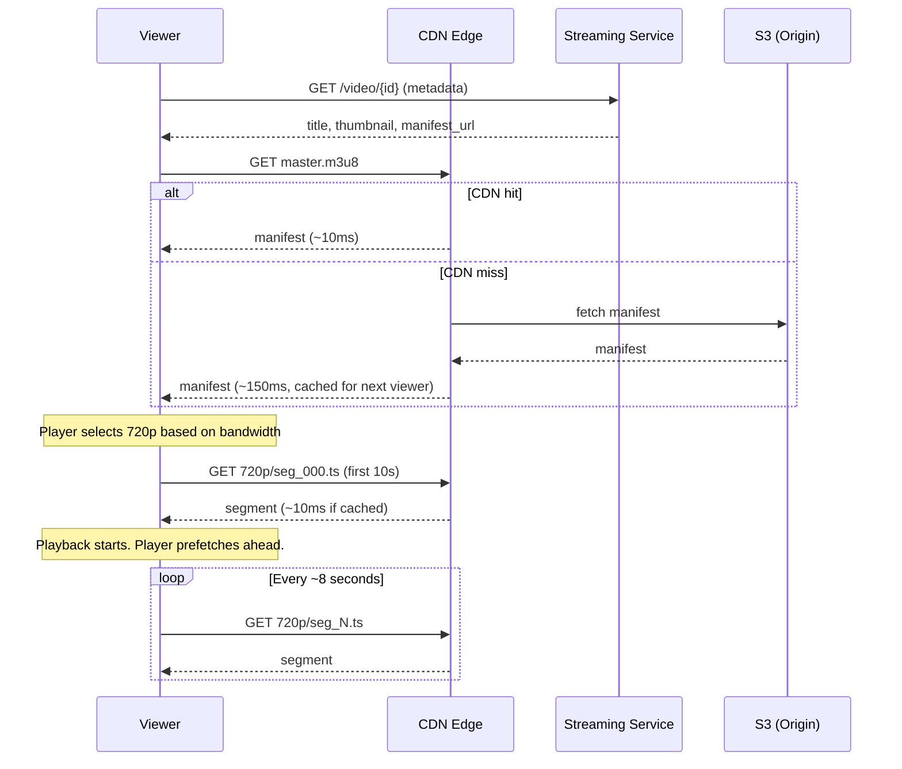

# System Design — YouTube (Video Streaming Platform)

> **Difficulty:** Hard HLD — video processing pipeline + CDN at internet scale.  
> **Key insight:** YouTube is two completely separate systems sharing a storage layer. Upload pipeline = async, write-heavy, latency-tolerant. Streaming system = sync, read-heavy, latency-critical. The CDN is not an optimisation — it IS the read architecture (46 Tbps cannot come from any origin cluster).  
> **What interviewers test:** Resumable upload, async transcoding pipeline, HLS/DASH segments, adaptive bitrate, CDN as the architecture, view count eventual consistency.

---

## Table of Contents

1. [Requirements](#1-requirements)
2. [Capacity Estimation](#2-capacity-estimation)
3. [The Two Systems](#3-the-two-systems)
4. [High-Level Design](#4-high-level-design)
5. [Upload Pipeline](#5-upload-pipeline)
6. [Transcoding Pipeline](#6-transcoding-pipeline)
7. [Streaming and CDN](#7-streaming-and-cdn)
8. [Adaptive Bitrate Streaming](#8-adaptive-bitrate-streaming)
9. [Database Schema](#9-database-schema)
10. [Trade-offs](#10-trade-offs)
11. [Interview Script](#11-interview-script)
12. [Follow-up Probes and Answers](#12-follow-up-probes-and-answers)

---

## 1. Requirements

### Functional
- Upload video (up to 10GB, any format: .mp4, .mov, .avi, .mkv)
- Transcode to multiple resolutions: 360p, 480p, 720p, 1080p, 4K
- Stream video with adaptive bitrate (quality adjusts to bandwidth in real time)
- Search videos by title, description, tags
- Recommendations feed
- Likes, comments, subscriptions (acknowledge, don't deep-dive)

### Non-functional
- Scale: 500 hours of video uploaded every minute, 1B hours watched per day
- Upload: must be resumable — 10GB uploads on mobile networks will drop
- Playback: start within 2 seconds, no buffering
- Availability: 99.99%
- Global: content must be geographically close to viewers

### Out of scope
- Live streaming (different pipeline — acknowledge, offer to discuss)
- DRM / content protection (acknowledge — AES-128 segments + key server)
- Ad serving
- Recommendation ML model internals

---

## 2. Capacity Estimation

```
Uploads:
  500 hrs/min = 8.3 hrs/sec of video
  Average compressed video: 300MB/hr
  Upload inbound throughput: 8.3 × 300MB = ~2.5 GB/sec

Storage:
  720,000 hrs/day uploaded
  5 resolutions = 5× original size after transcoding
  Daily new storage: 720,000 × 1GB/hr avg × 5 = ~3.6 PB/day
  Must use tiered object storage (S3 Standard → IA → Glacier)

Reads (streaming):
  1B hrs/day ÷ 86,400 = 11.5M concurrent streams
  Average bitrate: 4 Mbps (1080p)
  Bandwidth required: 11.5M × 4 Mbps = 46 Tbps
  ← No origin cluster can serve this. CDN IS the architecture.

CDN effectiveness:
  Top 0.1% of videos = 90%+ of traffic
  These are always in CDN cache
  Origin sees them only once — on first viewer in each region
```

---

## 3. The Two Systems

```
UPLOAD PIPELINE                              STREAMING SYSTEM
(async, write-heavy, latency-tolerant)       (sync, read-heavy, latency-critical)
─────────────────────────────────────        ─────────────────────────────────────
Users:     ~8K concurrent uploaders          Users:    11.5M concurrent viewers
Direction: Write-heavy                       Direction: Read-heavy
Latency:   Tolerant (transcoding: 30min)    Latency:  Critical (2s start, no buffer)
Design:    Event-driven pipeline             Design:   CDN-first, static file delivery
Failure:   Retry, requeue, re-transcode      Failure:  Fall back to lower quality

They share only ONE thing: the processed video storage bucket (S3).
Never let upload pipeline performance affect streaming.
```

---

## 4. High-Level Design

```
UPLOAD PIPELINE (async)                    STREAMING SYSTEM (sync)
───────────────────────────────────────    ────────────────────────────────────

Creator                                    Viewer
  │                                          │
  ▼                                          ▼
Upload Service                             CDN Edge (Akamai / Cloudflare)
  │  chunked, resumable                      │  hit  → manifest/segment in ~10ms
  │  pre-signed S3 URLs                      │  miss ↓
  ▼                                        Video Streaming Service
Raw Video Bucket (S3)                        │  serve HLS/DASH manifest URL
  │  S3 event trigger on upload complete      │
  ▼                                          ▼
Kafka: video.uploaded                      Metadata Service
  │                                          │  title, desc, view count
  ▼                                          ▼
Transcoding Workers                        Redis Cache
  │  one worker per resolution               │  hot metadata, view counters
  │  360p · 480p · 720p · 1080p · 2160p      │
  │  ALL run in parallel                     ▼
  │                                        PostgreSQL
  ▼                                          │  video metadata, user data
Processed Video Bucket (S3)                  │
  │  HLS/DASH segments + manifests           ▼
  │                                        Recommendation Engine
  └──▶ Metadata DB: status = published      (offline ML, pre-computed,
  └──▶ CDN origin pull on first request)     served from Redis)

                    ↑
        Shared storage layer only
        Upload pipeline → Processed Bucket ← Streaming System
```

---

## 5. Upload Pipeline

### Why resumable upload is required

```
Problem:
  A 4K video can be 10-20GB
  Mobile networks drop, browser tabs close, laptops hibernate
  Without resumability: failed upload = start from zero
  A creator 9.9GB into a 10GB upload should not restart

Solution: resumable multipart upload
  Split file into 10MB chunks
  Upload 3-5 chunks in parallel to maximise throughput
  Track which chunks succeeded
  On failure: retry only failed chunks, not the whole file
  Use pre-signed S3 URLs — file goes directly to S3, never through app servers
```

### Resumable upload flow

```
Step 1 — Initiate
  POST /api/v1/videos/upload/init
  Body: { title, fileSize, mimeType, checksum }
  Response: { upload_id, chunk_urls: [...presigned S3 URLs per chunk] }
  Server: creates pending video record in DB

Step 2 — Upload chunks in parallel
  Client splits file into 10MB chunks
  Uploads 3-5 chunks simultaneously to S3 via pre-signed URLs
  Each chunk upload goes directly to S3 — never through app servers
  S3 returns an ETag per chunk (checksum)

Step 3 — Track progress
  Client stores completed chunk numbers in localStorage
  On failure: only retry chunks where ETag is missing
  Server also tracks in Redis: HSET upload:{upload_id} chunk:1 "done" ...

Step 4 — Complete
  POST /api/v1/videos/upload/{upload_id}/complete
  Body: { etag_list: [...] }  ← ETags in order
  Server: calls S3 CompleteMultipartUpload to assemble parts
  S3 assembles all chunks into single object

Step 5 — Trigger processing
  S3 event triggers → Kafka: video.uploaded
  Video shows "processing" status to creator immediately
  Creator gets 201 response before transcoding starts
```

### Resumption after failure

```
GET /api/v1/videos/upload/{upload_id}/parts
→ { completed: [1,2,3,5], pending: [4,6,7,8] }

Client re-uploads only pending chunks
Server state in Redis: TTL 7 days (incomplete uploads auto-expire)

redis.hset("upload:{upload_id}", "chunk:1", "done", "chunk:2", "done", ...)
redis.expire("upload:{upload_id}", 604800)
```

---

## 6. Transcoding Pipeline

### Why transcoding is necessary

```
Problem 1 — Format heterogeneity:
  Creators upload: .mov (iPhone), .avi (Windows), .mkv (Linux), ProRes (DSLR)
  Browsers play: H.264 MP4, H.265, VP9, AV1
  Must normalise to standard codec

Problem 2 — Bandwidth diversity:
  4K at 25 Mbps won't play on a 2 Mbps mobile connection
  Must offer multiple quality levels
  Player picks the right quality for current bandwidth
```

### Pipeline stages

```
Stage 1 — Validation
  Verify file is a valid video container
  Check codec, duration, resolution
  Reject corrupted or malicious files early

Stage 2 — Thumbnail extraction
  Extract frames at 0%, 25%, 50%, 75%, 100% of video duration
  These become the auto-generated thumbnail options shown to creator

Stage 3 — Audio track
  Separate audio, transcode to AAC at multiple bitrates
  Runs in parallel with video transcoding

Stage 4 — Video transcoding (parallel per resolution)
  Spawn one worker per target resolution
  ALL resolutions run simultaneously — not sequentially
  360p finishes in ~2 min → published immediately
  4K finishes in ~30 min → added to manifest when ready

Stage 5 — Segmentation (HLS/DASH)
  Split each resolution into 10-second segments (.ts or .mp4 frag)
  Generate manifest files:
    HLS  → master.m3u8 + per-resolution playlist.m3u8
    DASH → master.mpd
  Store all segments and manifests in processed S3 bucket

Stage 6 — Publish
  Update video record: status = 'published', resolutions_ready = ['360p','480p']
  Push manifest to CDN origin
  Video is now publicly playable (in available resolutions)
```

### Parallel transcoding

```
Kafka consumer receives video.uploaded event
          │
          ▼
Dispatch one task per resolution — all start immediately
          │
    ┌─────┼─────┬─────┬─────┐
    ▼     ▼     ▼     ▼     ▼
  360p  480p  720p  1080p  2160p
  (~2m) (~3m) (~5m) (~12m) (~30m)
    │
    ▼ (first to finish)
  DB update: resolutions_ready += ['360p']
  CDN: manifest updated to include 360p
  Video is WATCHABLE (in SD) within ~2 minutes of upload

  (4K added to manifest 28 minutes later)
```

### Transcoding worker design

```
Spot / preemptible instances:
  Transcoding is CPU-intensive but not latency-sensitive
  Spot instances cost 60-90% less than on-demand
  If preempted: task is re-enqueued from last checkpoint
  Checkpoint every 60 seconds to minimise re-work on preemption

GPU acceleration:
  NVIDIA NVENC, Intel QuickSync — 10-50× faster than CPU for H.264/H.265
  Use GPU instances (g4dn, p3) not general compute for transcoding workers

FFmpeg:
  Industry standard for video transcoding
  Supports all codecs, hardware acceleration, streaming output formats
```

---

## 7. Streaming and CDN

### HLS — how video streaming actually works

```
Video streaming is HTTP file downloads — not a special protocol.
Files are just static objects. CDN caching works perfectly.

After transcoding, a video looks like this in S3:
  videos/{video_id}/
    master.m3u8          ← master manifest: lists all quality variants
    360p/
      playlist.m3u8      ← quality playlist: lists segments
      seg_000.ts         ← first 10 seconds
      seg_001.ts         ← seconds 10-20
      seg_002.ts         ← seconds 20-30
      ...
    720p/
      playlist.m3u8
      seg_000.ts
      ...
    1080p/
      ...

master.m3u8 content:
  #EXTM3U
  #EXT-X-STREAM-INF:BANDWIDTH=800000,RESOLUTION=640x360
  360p/playlist.m3u8
  #EXT-X-STREAM-INF:BANDWIDTH=2800000,RESOLUTION=1280x720
  720p/playlist.m3u8
  #EXT-X-STREAM-INF:BANDWIDTH=8000000,RESOLUTION=1920x1080
  1080p/playlist.m3u8
```

### Streaming flow — step by step

```
Step 1 — Video page load
  API returns metadata: title, description, thumbnail, master manifest URL
  This comes from origin (personalised, view counts change) — not CDN-cached

Step 2 — Player fetches master manifest
  GET cdn.example.com/videos/{id}/master.m3u8
  CDN-cached — returns in ~10ms
  Player reads quality options

Step 3 — Player selects quality
  Based on current bandwidth estimate
  Fetches quality playlist: GET .../720p/playlist.m3u8
  CDN-cached — ~10ms

Step 4 — Player downloads segments
  GET .../720p/seg_000.ts  ← first segment (10 seconds)
  GET .../720p/seg_001.ts  ← prefetched while playing seg_000
  GET .../720p/seg_002.ts  ← prefetched while playing seg_001
  Parallel prefetch: player stays 2-3 segments ahead of playback

  CDN hit: ~10ms   (popular videos: ~100% hit rate)
  CDN miss: ~150ms (cold video: CDN fetches from S3, caches for region)

Step 5 — Video starts in < 2 seconds
  Manifest (1 CDN request) + first segment (1 CDN request) = 2 total
  Both < 50ms from nearest CDN edge
  Playback begins before the full video is downloaded
```

### Streaming sequence (Mermaid — renders on GitHub web)



### Streaming flow — ASCII (works everywhere)

```
Viewer
  │
  ▼
CDN Edge (nearest to viewer)
  │
  ├── master.m3u8 cached?
  │     YES → return manifest (~10ms)
  │     NO  → fetch from S3, cache, return (~150ms, all future viewers get cache hit)
  │
  ▼
Player reads manifest, estimates bandwidth → selects 720p
  │
  ▼
CDN Edge
  ├── 720p/seg_000.ts → return (~10ms)   ← playback starts here
  ├── 720p/seg_001.ts → return (~10ms)   ← prefetched while playing seg_000
  ├── 720p/seg_002.ts → return (~10ms)   ← prefetched while playing seg_001
  │   [bandwidth drops]
  ├── 360p/seg_003.ts → return (~10ms)   ← ABR switches down quality
  │   [bandwidth recovers]
  └── 720p/seg_004.ts → return (~10ms)   ← ABR switches back up

Origin (S3) only serves cold cache misses.
Popular videos: CDN hit rate ≈ 100% after first viewer in each region.
```

---

## 8. Adaptive Bitrate Streaming

### How ABR works

```
Player maintains a buffer (goal: 30 seconds pre-downloaded)

Before fetching each segment:
  1. Measure download speed of previous segment
  2. Update bandwidth estimate (exponential moving average)
  3. Decide quality for next segment:

function selectQuality(bandwidthMbps, bufferSeconds):
  if bufferSeconds < 5:
    return '360p'    ← buffer critically low, prioritise speed over quality
  
  bitrateMap = { '360p': 0.8, '480p': 1.5, '720p': 2.8, '1080p': 8.0, '2160p': 25.0 }
  safeTarget = bandwidthMbps * 0.8   ← 20% safety margin
  
  return highest quality where bitrate ≤ safeTarget
  fallback: '360p' if nothing fits
```

### HLS vs DASH

```
HLS (HTTP Live Streaming):                DASH (Dynamic Adaptive Streaming):
  Apple standard                            ISO standard
  Native on iOS, Safari, tvOS               Android, Chrome, Firefox, Smart TVs
  Segment format: .ts (MPEG-TS)             Segment format: .mp4 (fragmented)
  Manifest: .m3u8                           Manifest: .mpd (XML)
  Codec: H.264, H.265                       Codec: VP9, AV1, H.264, H.265

In practice: support both.
  iOS / Safari → HLS
  Everything else → DASH (better codec support)
  Same underlying segments — only the manifest format differs
  Player negotiates based on browser/OS capability
```

### Segment duration trade-off

```
Longer segments (10s):
  ✓ Fewer HTTP requests, better CDN cache efficiency
  ✗ Quality switches are slow (up to 10s wait to switch)
  Used for: VOD (video on demand)

Shorter segments (2s):
  ✓ Fast quality switches, responsive to bandwidth changes
  ✗ More files, more HTTP requests, less CDN efficiency
  Used for: live streaming (latency matters most)

Recommendation: 6-10 seconds for VOD.
```

---

## 9. Database Schema

### Video metadata (PostgreSQL)

```sql
CREATE TABLE videos (
  id              UUID            PRIMARY KEY DEFAULT gen_random_uuid(),
  creator_id      UUID            NOT NULL REFERENCES users(id),
  title           TEXT            NOT NULL,
  description     TEXT,
  status          video_status    NOT NULL DEFAULT 'uploading',
  -- 'uploading' | 'processing' | 'published' | 'failed' | 'deleted'
  duration_secs   INT,
  view_count      BIGINT          DEFAULT 0,   -- updated via Redis counter flush
  like_count      BIGINT          DEFAULT 0,
  published_at    TIMESTAMPTZ,
  created_at      TIMESTAMPTZ     NOT NULL DEFAULT NOW()
);

-- Per-resolution processing status
CREATE TABLE video_renditions (
  video_id        UUID            REFERENCES videos(id),
  resolution      TEXT            NOT NULL,    -- '360p', '720p', '1080p'
  s3_manifest_key TEXT            NOT NULL,    -- path to HLS/DASH manifest
  bitrate_kbps    INT             NOT NULL,
  size_bytes      BIGINT,
  codec           TEXT            NOT NULL,    -- 'h264', 'h265', 'vp9'
  processed_at    TIMESTAMPTZ     NOT NULL,
  PRIMARY KEY (video_id, resolution)
);
```

### View count — the eventual consistency problem

```
Wrong approach — direct SQL increment:
  UPDATE videos SET view_count = view_count + 1 WHERE id = ?
  At 11.5M concurrent streams → write contention nightmare on hot videos
  One Gangnam Style video would lock the whole table

Correct approach — Redis counter + periodic flush:
  On each view event:
    redis.incr("views:{videoId}")

  Background job every 5 minutes:
    count = redis.getdel("views:{videoId}")
    db.execute("UPDATE videos SET view_count = view_count + ? WHERE id = ?",
               count, videoId)

Why eventual consistency is correct here:
  Displaying "1,234,567,001 views" vs "1,234,567,003 views" is meaningless
  YouTube shows "1.2B views" not an exact count
  This is deliberate product design, not a technical limitation
  Never try to maintain exact real-time counts in SQL
```

### Upload state tracking (Redis)

```
HSET upload:{upload_id}
     chunk:1     "done"
     chunk:2     "done"
     chunk:3     "done"
     chunk:4     "pending"
     total       8

EXPIRE upload:{upload_id} 604800   ← 7 days, incomplete uploads auto-expire
```

---

## 10. Trade-offs

### Async transcoding vs synchronous

```
Async (correct):
  ✓ Upload completes immediately — creator gets instant 201 response
  ✓ Transcoding takes 30 min for 4K — never make creator wait synchronously
  ✓ Failure is recoverable — re-enqueue and retry without affecting the creator
  ✗ Video not immediately watchable in all qualities

Progressive availability (correct companion):
  ✓ 360p finishes in ~2 min → publish and make watchable immediately
  ✓ Higher resolutions added as they complete
  ✓ Creator sees their video appear quickly, quality improves over time
```

### HLS segment size — 10s vs 2s

```
10-second segments (VOD):
  ✓ Fewer HTTP requests per viewer per hour
  ✓ Better CDN cache efficiency (fewer distinct objects)
  ✗ ABR quality switches take up to 10s

2-second segments (live streaming):
  ✓ Sub-10s end-to-end latency for live streams
  ✓ Fast quality switches
  ✗ 5× more files to store and serve, 5× more CDN requests

Recommendation: 10s for VOD, 2s for live.
```

### Pull CDN vs Push CDN for video

```
Pull CDN (default):
  ✓ Zero configuration — cache fills on first viewer request per region
  ✓ Never cache videos that nobody watches (long tail)
  ✗ First viewer in a region gets the cache miss latency (~150ms)

Push CDN (for predicted viral content):
  ✓ Zero latency for first viewer — already pre-cached
  ✓ Origin sees zero load even on viral spike
  ✗ Must predict which content will be popular
  ✗ Wasted bandwidth pushing content nobody watches

Recommendation: pull CDN for the long tail.
  Proactive push for: new videos from creators with 10M+ subscribers,
  known events (World Cup final, product launches).
  YouTube uses both — passive pull + active push for predicted high traffic.
```

### View count: SQL vs Redis counter

```
SQL direct increment:
  ✗ Write contention on popular videos
  ✗ Table-level locks under heavy concurrent updates
  ✗ Primary DB load scales with video popularity (worst-case)

Redis counter + periodic flush:
  ✓ O(1) INCR with no contention — handles millions/sec trivially
  ✓ DB sees batched writes every 5 minutes regardless of video popularity
  ✓ Data loss risk: at most 5 minutes of view counts if Redis crashes
  ✓ Displayed count is eventually consistent — acceptable for view counts
```

---

## 11. Interview Script

### Opening — the two systems framing

> "Before I start: YouTube is two fundamentally different systems that share a storage layer. The upload pipeline is async, write-heavy, and latency-tolerant — a creator doesn't care if transcoding takes 30 minutes as long as their video eventually appears. The streaming system is sync, read-heavy, and latency-critical — a viewer abandons in under 3 seconds. I'll design them separately and connect them only through the processed video storage."

### The CDN insight — say this early

> "At 1 billion hours watched per day, that's 11.5 million concurrent streams at 4 Mbps average — 46 terabits per second of bandwidth. No origin cluster can serve this. The CDN is not an optimisation here — it is the read architecture. 95 percent of bandwidth is served from CDN edge nodes. Origin handles only cache misses and new content."

### HLS and streaming mechanics

> "Video streaming is just HTTP file downloads served over CDN. Each video is transcoded into multiple resolutions and split into 10-second segments. The player fetches a manifest listing quality variants, then downloads segments sequentially. Adaptive bitrate switching means the player monitors download speed and switches quality up or down before each new segment — targeting 80% of measured bandwidth to leave a safety margin."

### Transcoding architecture

> "Transcoding is async and event-driven. Upload completes → S3 event → Kafka → workers. I'd dispatch all 5 resolutions in parallel — 360p finishes in about 2 minutes, 4K takes 30. Progressive availability: publish 360p as soon as it's ready so the video is watchable immediately. For workers I'd use spot instances — CPU-intensive but not latency-sensitive, ideal for preemptible compute at 70% cost savings."

### View count — the eventual consistency answer

> "View counts cannot be a direct SQL increment at 11.5M concurrent streams — write contention on a single row is catastrophic for popular videos. I'd use Redis INCR per video, flushed to PostgreSQL in batches every 5 minutes. Views are always eventually consistent — YouTube shows '1.2B views' not an exact count. That approximation is a deliberate product decision, not a limitation."

---

## 12. Follow-up Probes and Answers

**"How do you handle live streaming?"**  
Different pipeline — no pre-processing step. The creator's encoder (OBS, mobile camera) splits the feed into 2-second segments in real time using RTMP push to an ingest server. Segments are immediately available on CDN. Latency trade-off: 30-second delay for reliability vs 5-second delay for interactive live (different segment sizes and buffer depths). The rest of the system (CDN, adaptive bitrate) is identical to VOD.

**"How do you implement video search?"**  
Elasticsearch with inverted index on title, description, tags, and auto-generated captions. Ranking combines text relevance with engagement signals — CTR, watch time percentage, like-to-view ratio. Ranking is a pre-computed offline batch job, not a real-time computation. Search results are eventually consistent — a new video appears in search within 1-5 seconds of publishing as the Elasticsearch index consumer processes the Kafka event.

**"What happens when a video goes viral unexpectedly?"**  
CDN absorbs it completely. Cache hit rate spikes to near 100% for that video — origin sees zero additional load beyond the initial cache-miss from the first viewer in each CDN region. The entire viral event is served from edge cache. The only concern is CDN edge cache capacity, but popular videos are tiny relative to total CDN storage.

**"How do you handle DRM / content protection?"**  
AES-128 encryption on every video segment. Decryption keys are served by a separate key server that enforces entitlements (is this user subscribed? is this content available in their region?). CDN caches the encrypted segments freely — without the key, segments are useless ciphertext. The key server enforces DRM at key issuance time, not at CDN edge.

**"How do recommendations work?"**  
Two-stage pipeline: (1) candidate generation — collaborative filtering identifies candidates based on user watch history and similar user behaviour. (2) ranking — an ML model scores candidates on predicted watch time percentage, CTR, and freshness. Both stages are computed offline (hours to days old). Real-time signals (just watched, just searched) modify the pre-computed ranked list at serve time by re-ranking the top N candidates. The final list is served from Redis, not computed on the fly.

**"How do you handle video deletion?"**  
Soft delete first — set status = 'deleted' in DB. CDN cache is purged via the CDN's purge API (Cloudflare, Akamai all support bulk purge by URL prefix). S3 objects are deleted asynchronously — object lifecycle rules or a background job removes the actual segments after 30 days. CDN purge is the critical step — must happen before returning the delete confirmation to the creator.

---
